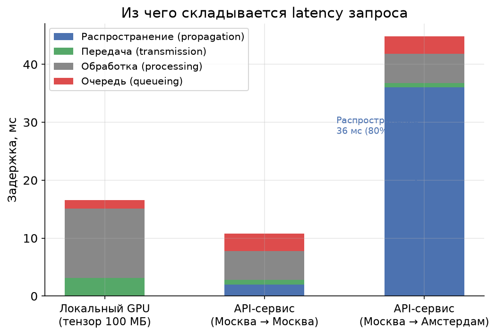
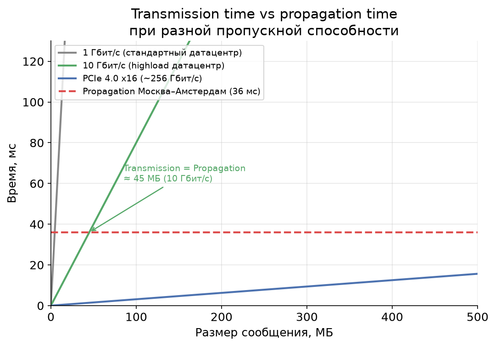
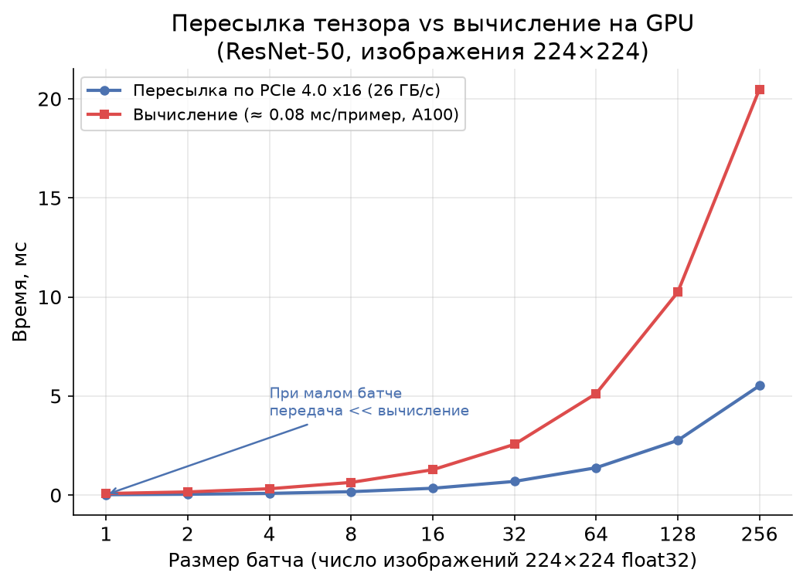

# Урок 1. Из чего состоит Latency?

> **TL;DR:** Полное время отклика системы складывается из четырёх компонент: время распространения сигнала, время передачи данных, время обработки и время ожидания в очереди. Первая из них — физическая константа, которую нельзя победить никаким апгрейдом железа. Остальные три — поле для инженерной работы. Понять эту разницу — значит перестать чинить то, что починить нельзя, и начать чинить то, что можно.

---

## Откуда вообще берётся задержка

Представьте: вы заказали доставку пиццы из ресторана в пяти кварталах от вас. Курьер должен:

1. Взять пиццу с кухни и упаковать её — **обработка (processing)**;
2. Подождать, пока освободится свободный курьер — **ожидание в очереди (queueing)**;
3. Физически проехать эти пять кварталов — **распространение (propagation)**;
4. Выгрузить коробку и занести в лифт — **передача (transmission)**.

В компьютерных системах всё то же самое. Когда браузер делает запрос к серверу, когда ML-сервис отправляет тензор на GPU, когда Kafka-консьюмер читает сообщение из топика — за каждым из этих событий скрыты ровно эти четыре компоненты задержки.

Давайте разберём их по очереди.

---

## Четыре компоненты задержки

### Время распространения (propagation time)

Это время, которое требуется сигналу, чтобы физически добраться из точки A в точку B. Для электрических сигналов в медном кабеле — скорость близка к скорости света в вакууме. В оптоволокне свет движется медленнее из-за показателя преломления стекла: примерно $2 \times 10^5$ км/с, то есть около двух третей от скорости света в вакууме.

Посчитаем конкретный пример. Расстояние по прямой от Москвы до Амстердама — около 2500 км. Маршрут кабеля по факту длиннее, возьмём коэффициент 1.4 — получается ~3500 км реального пути.

$$t_{\text{prop}} = \frac{d}{v} = \frac{3500 \text{ км}}{200\,000 \text{ км/с}} \approx 0{,}0175 \text{ с} = 17{,}5 \text{ мс}$$

Это **односторонняя** задержка. Round-Trip Time (RTT) — туда и обратно — будет порядка 35–40 мс. Попробуйте сами: `ping ams-ix.net` из московской сети почти всегда покажет 35–45 мс.

**Ключевое свойство:** propagation time зависит только от расстояния и физической среды. Купите сервер в десять раз мощнее — эти миллисекунды никуда не денутся. Добавьте десять реплик — то же самое. Единственный способ её уменьшить — физически приблизить узлы друг к другу (geo-распределение, CDN, edge-серверы).

### Время передачи (transmission time)

Это время, которое требуется, чтобы «протолкнуть» все биты сообщения через канал. Зависит от размера сообщения и пропускной способности:

$$t_{\text{trans}} = \frac{L}{B}$$

где $L$ — размер сообщения (биты), $B$ — пропускная способность канала (бит/с).

**Пример.** Передать 100 МБ по каналу 1 Гбит/с:

$$t_{\text{trans}} = \frac{100 \times 8 \text{ Мбит}}{1000 \text{ Мбит/с}} = 0{,}8 \text{ с} = 800 \text{ мс}$$

Тот же файл через канал 10 Гбит/с — 80 мс. Через PCIe 4.0 x16 (~256 Гбит/с в шине, эффективно ~32 ГБ/с полезной пропускной способности) — доли миллисекунды.

**Ключевое свойство:** transmission time можно уменьшить тремя способами:
- увеличить пропускную способность канала (более мощный GPU, более широкий сетевой интерфейс);
- сжать данные (уменьшить $L$);
- разбить большой запрос на мелкие части — тогда первые биты начнут обрабатываться раньше, чем переданы все остальные (этот приём используется в стриминге и чанкированных запросах).

### Время обработки (processing time)

Время, которое занимает полезная работа: выполнить SQL-запрос, прогнать тензор через нейросеть, применить бизнес-логику. Зависит от мощности процессора/GPU и сложности алгоритма.

Это поле для оптимизации алгоритмов, профилирования, кеширования, выбора правильных структур данных.

### Время ожидания в очереди (queueing time)

Запрос пришёл, но сервер в данный момент занят другим запросом. Придётся подождать. Это и есть queueing time.

Интуитивно кажется, что если сервер загружен на 50%, то очередь небольшая. Но это не так: даже при 50%-ной загрузке случайные всплески (bursts) создают очередь, которая иногда бывает удивительно длинной. Queueing time — самый нелинейный и коварный компонент задержки. Именно ему посвящена большая часть этого курса.

---

## Итоговая формула и наглядная картинка

Полное время отклика (response time, или latency) системы:

$$W = t_{\text{prop}} + t_{\text{trans}} + t_{\text{proc}} + t_{\text{queue}}$$

На графике ниже видно, как соотносятся эти компоненты в трёх типичных сценариях.

Обратите внимание на третий столбец — запрос между датацентрами в разных городах. Propagation (синий сегмент) занимает ~80% всего времени отклика. Никакой апгрейд GPU или увеличение числа воркеров не уберёт эти миллисекунды.

---

## Где что доминирует: размер сообщения как водораздел

Transmission time и propagation time «соревнуются» в зависимости от двух факторов: размера сообщения и пропускной способности канала.

Что показывает этот график:

- При маленьких сообщениях (левая часть) transmission time мала для любого канала. Propagation — константа — здесь доминирует. Это мир API-запросов, пингов, коротких JSON.
- При больших сообщениях (правая часть) transmission time начинает превышать propagation. Купить более широкий канал становится осмысленным.
- Горизонтальная пунктирная линия — это propagation Москва–Амстердам (~36 мс). Для канала 10 Гбит/с «точка безразличия» — около 45 МБ. Меньше 45 МБ — propagation важнее; больше — transmission важнее.

**Практический вывод:** для большинства HTTP-запросов (payload < 1 МБ, датацентры в одном регионе) transmission time ничтожна. Оптимизировать её бессмысленно: нужно либо уменьшать latency приближением к пользователю (propagation), либо уменьшать queueing (очереди).

---

## Разбираем ML-инференс: запрос по сети, тензор, PCIe и GPU

Рассмотрим нашего первого «героя» курса — сервис ML-инференса. Это отдельный сетевой сервис: у него нет «своих» пользователей, к нему по HTTP/gRPC обращаются **другие сервисы** — бэкенд, который хочет классифицировать загруженную пользователем картинку, пайплайн модерации, рекомендательная система. Поступает запрос на классификацию изображения с помощью ResNet-50. Проследим его путь целиком:

1. **Сеть.** Запрос с изображением летит от сервиса-клиента до инференс-сервиса: propagation (внутри датацентра — доли миллисекунды) + transmission (зависит от размера картинки и полосы).
2. **Очередь.** Если все обработчики заняты, запрос ждёт — это queueing, главный герой следующих уроков.
3. **Шина.** Данные (тензор — матрица чисел float32) из оперативной памяти передаются на видеокарту по шине PCIe.
4. **GPU** выполняет прямой проход (forward pass) нейросети.
5. **Ответ** — метка класса и вероятности, считанные байты — возвращается по сети сервису-клиенту.

### Считаем реальный пример

Начнём с сетевого плеча. Сервис-клиент и инференс-сервис стоят в одном датацентре: внутренняя сеть 10 Гбит/с (= 1250 МБ/с), RTT между машинами ~0,2 мс. Изображение перед отправкой — это те же ~0,6 МБ (см. расчёт тензора ниже), значит transmission:

$$t_{\text{net}} = \frac{0{,}574 \text{ МБ}}{1250 \text{ МБ/с}} \times 1000 \approx 0{,}46 \text{ мс}$$

Итого сеть обходится примерно в $0{,}2 + 0{,}46 \approx 0{,}7$ мс. Теперь — что происходит внутри сервиса.

Одно изображение RGB 224×224 в формате float32:

$$L = 3 \times 224 \times 224 \times 4 \text{ байт} = 602\,112 \text{ байт} \approx 0{,}574 \text{ МБ}$$

Пропускная способность PCIe 4.0 x16 — около 32 ГБ/с (эффективная полезная пропускная способность):

$$t_{\text{trans}} = \frac{0{,}574 \text{ МБ}}{32\,000 \text{ МБ/с}} \times 1000 \approx 0{,}018 \text{ мс}$$

Время вычисления ResNet-50 на современной GPU (порядок): ~5–15 мс на одно изображение.

То есть **пересылка тензора по PCIe занимает меньше 1% от времени вычисления**. Шина PCIe в этом сценарии вообще не является узким местом.

Соберём полный путь запроса (пока без очереди — ей посвящены следующие уроки):

| Компонента | Время |
|---|---|
| Сеть от сервиса-клиента (propagation + transmission) | ~0,7 мс |
| Пересылка тензора по PCIe | ~0,02 мс |
| Вычисление на GPU | ~10 мс |
| Ответ по сети (сотни байт) | ~0,2 мс |
| **Итого** | **~11 мс** |

Внутри одного датацентра доминирует вычисление: сеть добавляет меньше десятой части, PCIe — сотые доли. Но стоит сервису-клиенту оказаться в другом городе — и propagation (десятки миллисекунд RTT) обгонит само вычисление, как в третьем столбце графика в начале урока.

### А что если батч большой?

Посмотрим на зависимость от размера батча:

Синяя линия (пересылка по PCIe) растёт линейно с размером батча. Красная (вычисление) тоже, но GPU эффективно параллелизует вычисления, поэтому в абсолютных числах время вычисления всегда доминирует над временем передачи. Даже для батча из 256 изображений (~147 МБ) пересылка занимает менее 5 мс, а вычисление — на порядок больше.

**Вывод из ML-примера:** если ваш инференс-сервис отвечает медленно, первым делом смотрите на время вычисления и queueing (ждут ли запросы в очереди), затем — на сетевое плечо до сервисов-клиентов (не уехали ли они в другой регион). Пропускная способность PCIe-шины — последнее, что стоит подозревать.

---

## Propagation — физический предел, с которым нужно смириться

Вернёмся к сети. Проведём мысленный эксперимент: у нас есть сервис в Москве, а пользователь в Амстердаме. Мы хотим уменьшить RTT.

| Что мы делаем | Эффект на latency |
|---|---|
| Ставим GPU в 10 раз мощнее | processing↓, но propagation не изменится |
| Масштабируем на 100 серверов | queueing↓, но propagation не изменится |
| Сжимаем запрос в 10 раз | transmission↓ (незначительно при малом payload) |
| Открываем POP в Амстердаме | propagation↓ — расстояние сократилось! |

Скорость света в оптоволокне ~200 000 км/с — это фундаментальный физический предел. Пока физики не придумают что-то новее, с этим нужно работать архитектурно: CDN, geo-балансировка, репликация данных ближе к пользователям.

Именно поэтому крупные облачные провайдеры (AWS, Google Cloud, Yandex Cloud) строят датацентры на каждом континенте и даже в каждой крупной стране — не для надёжности (хотя и для неё тоже), а чтобы уменьшить физическое расстояние до конечного пользователя.

---

## Мостик к следующему уроку

Мы разобрались, из чего складывается latency. Из четырёх компонент две — propagation и transmission — хорошо поддаются расчёту. Но оставшиеся две — processing и queueing — зависят от того, **сколько запросов** одновременно обрабатывает система и **как долго** каждый из них занимает ресурс.

В следующем уроке мы познакомимся с теоремой Литтла — математическим законом, который связывает число запросов в системе, интенсивность их прихода и среднее время отклика. Этот закон станет нашим главным инструментом на протяжении всего курса.

---

## Главное из урока

- Полное время отклика: $W = t_{\text{prop}} + t_{\text{trans}} + t_{\text{proc}} + t_{\text{queue}}$.
- **Propagation time** — физическая константа, зависит только от расстояния и среды. Скорость света в оптоволокне ~200 000 км/с. Ускорить сервер не поможет — нужно приближать сервер к пользователю.
- **Transmission time** — $L / B$, зависит от размера сообщения и пропускной способности. Уменьшается мощностью канала, сжатием, разбивкой на части.
- Для коротких сообщений (< единиц МБ) в сети propaganda доминирует над transmission. Оптимизировать transmission в этом случае бессмысленно.
- В ML-инференсе на локальном GPU пересылка тензора по PCIe 4.0 занимает единицы микросекунд — на порядки меньше времени вычисления. Узкое место — GPU-вычисление и очередь запросов.
- **Processing и queueing** — поле для инженерной оптимизации. Queueing — самый нелинейный и непредсказуемый компонент, ему посвящены следующие уроки.

---

## Проверь себя

### Вопрос 1
Датацентр находится в Москве. Пользователь — в Токио (~9000 км по кабелю). Вы купили новый сервер, который обрабатывает запросы в 5 раз быстрее. Что произойдёт с RTT (Round-Trip Time) для запросов от этого пользователя?

- [ ] RTT уменьшится примерно в 5 раз
- [ ] RTT уменьшится незначительно (только на долю времени обработки)
- [x] RTT почти не изменится, так как propagation time доминирует
- [ ] RTT увеличится из-за большей нагрузки на сеть

> **Пояснение:** Propagation time до Токио — около 45 мс в одну сторону (~90 мс RTT). Даже если время обработки было 5 мс и стало 1 мс, суммарный RTT изменится с ~95 мс до ~91 мс — менее 5%. Новый сервер поможет при высокой нагрузке (уменьшит queueing), но не победит физическое расстояние.

### Вопрос 2
Тензор размером 10 МБ передаётся по PCIe 4.0 x16 с пропускной способностью 32 ГБ/с. Чему равно время передачи?

- [ ] ~3 мс
- [ ] ~0.03 мс
- [x] ~0.31 мс
- [ ] ~31 мс

> **Пояснение:** $t = 10 \text{ МБ} / 32\,000 \text{ МБ/с} \times 1000 = 0{,}3125 \text{ мс}$. Варианты с 3 мс и 31 мс — ошибка на порядок (перепутали ГБ/с и МБ/с или МБ и Гбит). Правильный расчёт нужно делать в согласованных единицах: всё переводить либо в байты/с, либо в биты/с.

### Вопрос 3
Какой из способов уменьшить transmission time является самым эффективным при условии, что размер сообщения фиксирован?

- [x] Увеличить пропускную способность канала (более широкий интерфейс)
- [ ] Приблизить серверы друг к другу географически
- [ ] Уменьшить количество одновременных запросов
- [ ] Перейти на более быстрый процессор

> **Пояснение:** Формула $t_{\text{trans}} = L / B$ — если $L$ фиксирован, то единственный способ уменьшить $t_{\text{trans}}$ — увеличить $B$. Приближение серверов уменьшает propagation, а не transmission. Меньше запросов уменьшает queueing. Более быстрый процессор уменьшает processing.

### Вопрос 4
Инженер хочет ускорить ML-сервис инференса. Профилирование показало, что 95% времени запроса тратится на вычисление нейросети на GPU. На что нужно тратить усилия в первую очередь?

- [ ] Апгрейд сетевого интерфейса с 1 Гбит/с до 10 Гбит/с
- [ ] Переезд датацентра ближе к пользователям
- [x] Оптимизация вычислений на GPU (квантизация, pruning, более эффективная архитектура)
- [ ] Сжатие тензоров перед передачей по PCIe

> **Пояснение:** Если 95% времени — это processing (вычисление GPU), то нужно атаковать именно эту компоненту. Апгрейд сети и переезд влияют на transmission и propagation — суммарно менее 5% времени. Сжатие тензоров перед PCIe-передачей добавит дополнительную работу CPU и ускорит передачу, которая и без того незначительна.

### Вопрос 5
Свет в оптоволокне распространяется медленнее, чем в вакууме. Почему?

- [ ] Оптоволокно не передаёт свет — только электрические сигналы
- [ ] Из-за сопротивления стекла
- [x] Стекло имеет показатель преломления > 1, из-за чего скорость света в нём ~2/3 от скорости в вакууме
- [ ] Это неверно: в оптоволокне свет движется быстрее

> **Пояснение:** Скорость света в среде: $v = c / n$, где $n$ — показатель преломления. Для кварцевого стекла $n \approx 1{,}46$, поэтому $v \approx c / 1{,}46 \approx 0{,}68 \cdot c \approx 200\,000$ км/с. «Сопротивление» — понятие из электрических цепей, к оптике не относится.

### Вопрос 6
У вас есть два сценария передачи файла размером 1 ГБ:
- **Сценарий A:** Канал 100 Мбит/с, узлы в одном датацентре (propagation ~0.1 мс).
- **Сценарий B:** Канал 10 Гбит/с, узлы в разных странах (propagation ~30 мс).

Какой сценарий завершит передачу быстрее?

- [x] Сценарий A: transmission (~80 с) + propagation (0.001 с) ≈ 80 с; Сценарий B: transmission (0.8 с) + propagation (0.03 с) ≈ 0.83 с — Сценарий B быстрее
- [ ] Сценарий A, потому что propagation в сценарии B больше
- [ ] Примерно одинаково
- [ ] Сценарий A, потому что в одном датацентре меньше задержек

> **Пояснение:** При передаче большого файла (1 ГБ) transmission time доминирует над propagation. В сценарии A: $1 \text{ ГБ} / 12{,}5 \text{ МБ/с} \approx 80 \text{ с}$; в сценарии B: $1 \text{ ГБ} / 1250 \text{ МБ/с} \approx 0{,}8 \text{ с}$. Propagation в 30 мс добавляет ничтожно мало к 0.8 с. Сценарий B быстрее примерно в 100 раз. Этот пример иллюстрирует: при больших объёмах данных важна пропускная способность, а не latency.

---

## Задачи

### Задача 1

ML-инференс-сервис принимает по сети запросы от других сервисов на обработку тензоров. Каждый тензор — батч из 32 изображений размером 224×224 пикселя в формате float32 (RGB). Тензор передаётся с RAM на GPU по шине PCIe 4.0 x16 с пиковой пропускной способностью 32 ГБ/с. GPU выполняет инференс модели EfficientNet-B0 за 8 мс на батч. Сетевой запрос от клиента до датацентра добавляет 2 мс propagation (в одну сторону) и 0.5 мс на передачу payload запроса.

Определите:
1. Размер тензора в МБ.
2. Время пересылки тензора по PCIe (transmission time GPU).
3. Полную латентность одного запроса (без queueing), если ответ возвращается по той же сети.
4. Какая компонента является узким местом?

Решение

**1. Размер тензора:**

$$L = 32 \text{ изобр.} \times 3 \text{ канала} \times 224 \times 224 \text{ пикселей} \times 4 \text{ байт/пиксель}$$

$$L = 32 \times 3 \times 224 \times 224 \times 4 = 32 \times 602\,112 = 19\,267\,584 \text{ байт} \approx 18{,}38 \text{ МБ}$$

**2. Время пересылки по PCIe:**

$$t_{\text{trans, PCIe}} = \frac{18{,}38 \text{ МБ}}{32\,000 \text{ МБ/с}} \times 1000 \approx 0{,}57 \text{ мс}$$

**3. Полная латентность:**

Цепочка: сеть (propagation туда) → сеть (transmission запроса) → GPU transfer → GPU compute → сеть (propagation обратно) → сеть (transmission ответа).

Для простоты считаем ответ маленьким (вектор вероятностей ≪ 1 КБ, transmission ≈ 0):

$$W = t_{\text{prop, туда}} + t_{\text{trans, запрос}} + t_{\text{trans, PCIe}} + t_{\text{proc, GPU}} + t_{\text{prop, обратно}}$$

$$W = 2 + 0{,}5 + 0{,}57 + 8 + 2 = 13{,}07 \text{ мс}$$

**4. Узкое место:**

| Компонента | Время, мс | Доля |
|---|---|---|
| Propagation (туда + обратно) | 4.0 | 30.6% |
| Transmission (сеть) | 0.5 | 3.8% |
| Transmission (PCIe) | 0.57 | 4.4% |
| Processing (GPU) | 8.0 | 61.2% |

**Узкое место — GPU-вычисление (61% от общей латентности).** Именно его нужно оптимизировать: квантизация модели, pruning, более быстрый GPU, эффективная архитектура (EfficientNet-B1 с меньшей моделью, TensorRT и т.п.).

### Задача 2

Команда рассматривает два варианта развёртывания сервиса для европейских пользователей (условно, центр — Берлин):

- **Вариант 1:** Один датацентр в Москве. RTT Берлин–Москва ≈ 40 мс.
- **Вариант 2:** Добавить POP (Point of Presence) в Берлине. RTT Берлин–Берлин ≈ 2 мс.

Сервис обрабатывает каждый запрос за 5 мс. Размер запроса и ответа — по 10 КБ, сеть 100 Мбит/с.

1. Посчитайте transmission time для запроса и ответа.
2. Посчитайте общую latency для обоих вариантов (без queueing).
3. На сколько процентов уменьшится latency при открытии берлинского POP?
4. Оправдан ли переезд, если queueing в московском ДЦ составляет 30 мс?

Решение

**1. Transmission time (запрос + ответ):**

$$t_{\text{trans}} = \frac{10 \text{ КБ} \times 8}{100\,000 \text{ Мбит/с}} \times 1000 = \frac{0{,}08 \text{ Мбит}}{100 \text{ Мбит/с}} \times 1000 = 0{,}8 \text{ мс}$$

Запрос + ответ = $0{,}8 \times 2 = 1{,}6$ мс. (Это небольшая добавка — сравним с propagation.)

**2. Полная latency:**

Вариант 1 (Москва):
$$W_1 = 40 + 1{,}6 + 5 = 46{,}6 \text{ мс}$$

Вариант 2 (Берлин):
$$W_2 = 2 + 1{,}6 + 5 = 8{,}6 \text{ мс}$$

**3. Снижение latency:**

$$\Delta = \frac{46{,}6 - 8{,}6}{46{,}6} \times 100\% \approx 81{,}5\%$$

Открытие локального POP даёт почти пятикратное ускорение за счёт уменьшения propagation.

**4. С учётом queueing:**

Если в московском ДЦ queueing = 30 мс:

$$W_1' = 40 + 1{,}6 + 5 + 30 = 76{,}6 \text{ мс}$$

Если берлинский POP при меньшей нагрузке имеет queueing ≈ 0:

$$W_2' = 2 + 1{,}6 + 5 + 0 = 8{,}6 \text{ мс}$$

Итоговое ускорение — почти в 9 раз. Переезд определённо оправдан: он одновременно уменьшает и propagation, и — за счёт распределения нагрузки — queueing. Именно так работает геораспределённое развёртывание крупных сервисов.

