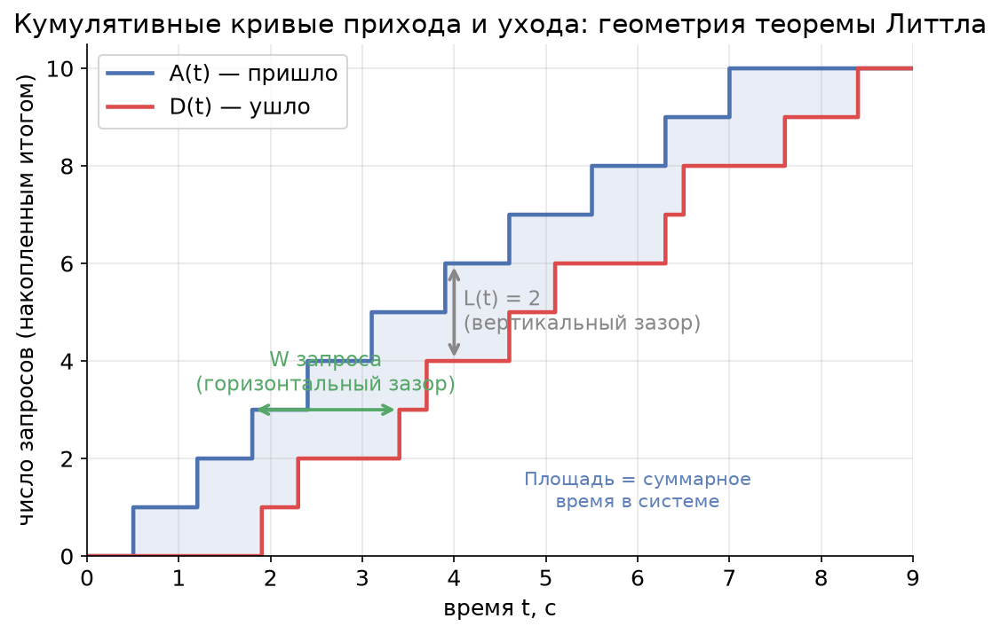
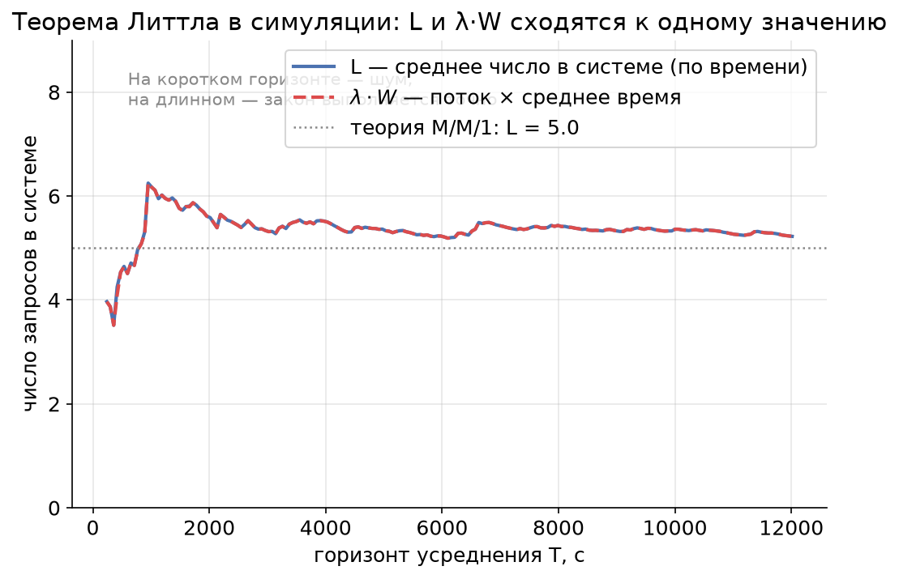
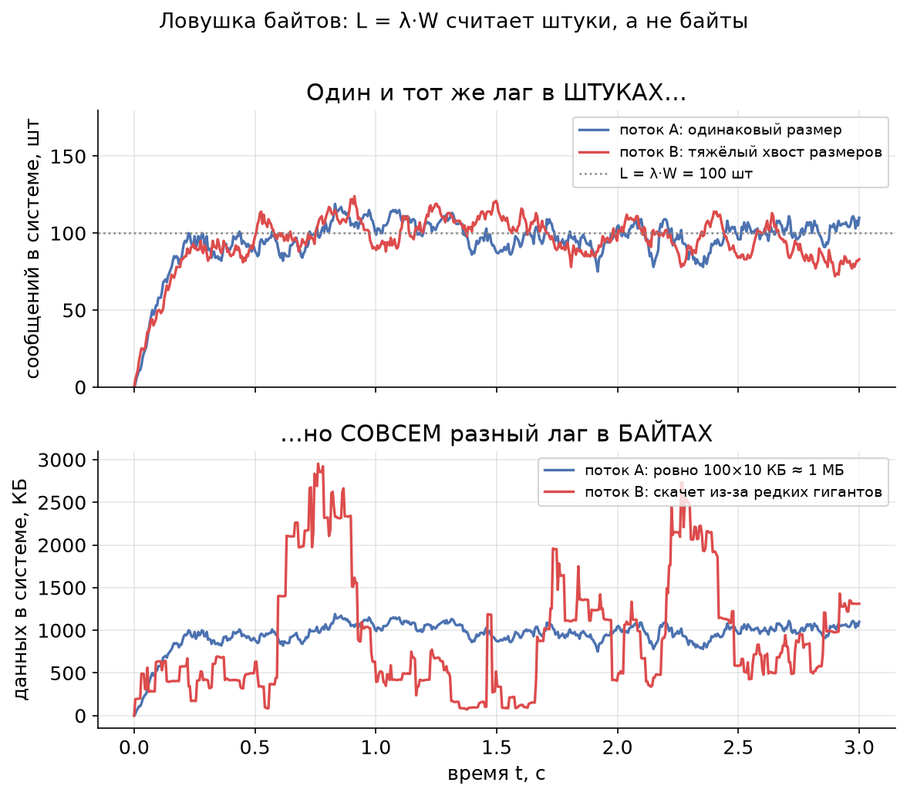

# Урок 2. Теорема Литтла — «закон сохранения» в очередях

> **TL;DR:** Среднее число запросов в системе равно интенсивности входящего потока, умноженной на среднее время отклика: $L = \lambda W$. Это operational law — он выполняется почти всегда и не зависит ни от распределений, ни от дисциплины обслуживания, ни от числа серверов. Главная ловушка: теорема считает запросы в штуках, а не в байтах. Зато она позволяет вычислить то, что трудно измерить напрямую, — например, среднее время отклика по двум легко наблюдаемым метрикам.

В уроке 1 мы разобрали, из чего складывается latency одного запроса: время передачи и время распространения. Но highload-система живёт не одним запросом — в ней одновременно «варятся» десятки и сотни запросов. Как связать поток запросов, их количество внутри системы и время, которое каждый там проводит? Ответ даёт удивительно простая формула, которую в 1961 году доказал Джон Литтл.

## Интуиция: люди в баре

Представьте бар. Каждый час в него заходит в среднем 30 человек ($\lambda = 30$ человек/час). В среднем каждый посетитель проводит внутри 2 часа ($W = 2$ часа). Вопрос: сколько в среднем человек находится в баре в любой момент времени?

Интуиция подсказывает: $30 \times 2 = 60$ человек. И это правильный ответ. Это и есть теорема Литтла:

$$L = \lambda W$$

где:

- $L$ — среднее число запросов **в системе** (people in the system);
- $\lambda$ — интенсивность входящего потока (arrival rate), запросов в единицу времени;
- $W$ — среднее время, которое запрос проводит в системе (response time / sojourn time).

Почему это работает? Подумайте о «единицах». Если поток — это «30 человек в час», а каждый «задерживается на 2 часа», то за время своего визита один человек как бы «занимает место» в баре. Чем гуще поток на входе и чем дольше люди остаются, тем больше их накапливается внутри. Произведение потока на время визита и есть среднее наполнение.

Та же логика — про любую систему с входом и выходом: кассу супермаркета, дорожный участок, пул соединений к базе, очередь сообщений Kafka, GPU-сервер инференса. Везы работает одна формула.

## Operational law: почему это почти всегда верно

Самое поразительное в теореме Литтла — её **универсальность**. Это **operational law**: утверждение не про вероятностную модель, а про саму «бухгалтерию» потока. Оно:

- **не зависит от распределения** времени между приходами ($\lambda$ может быть хоть пуассоновским, хоть строго периодическим);
- **не зависит от распределения** времени обслуживания;
- **не зависит от дисциплины обслуживания** — FIFO, LIFO, приоритеты, processor sharing — без разницы;
- **не зависит от числа серверов** — один консьюмер или сто, одна касса или двадцать.

Звучит почти как магия, но на самом деле это бухгалтерское тождество. Поясним геометрически — без строгого доказательства.

> **Опциональная врезка: геометрия через площадь.**
> Нарисуем две кумулятивные (накопленные) кривые. $A(t)$ — сколько запросов **пришло** к моменту $t$. $D(t)$ — сколько **ушло** (обслужилось) к моменту $t$. Поскольку уйти можно только после того, как пришёл, $A(t) \ge D(t)$ всегда.
>
> 
>
> Посмотрите на картинку внимательно:
> - **Вертикальный зазор** между кривыми в момент $t$ — это $A(t) - D(t)$, то есть сколько запросов прямо сейчас находится в системе. Обозначим его $L(t)$.
> - **Горизонтальный зазор** на уровне $i$-го запроса — это время между его приходом и уходом, то есть $W_i$ — время, проведённое им в системе.
> - **Площадь между кривыми** — это сумма всех «времён в системе» по всем запросам. Её можно посчитать двумя способами: интегрируя вертикальные зазоры по времени (получим $L \times T$, где $T$ — горизонт) или складывая горизонтальные зазоры по запросам (получим $N \times W$, где $N$ — число запросов). Одна и та же площадь — значит, $L \cdot T = N \cdot W$. Делим на $T$ и вспоминаем, что $\lambda = N / T$ — получаем $L = \lambda W$.
>
> Никаких предположений о случайности мы не делали — только посчитали площадь двумя способами. Поэтому закон и универсален.

## Условия применимости

«Почти всегда» — не «всегда». Чтобы $L = \lambda W$ выполнялось, нужны три условия. Они почти всегда выполнены на практике, но знать их полезно — иначе можно применить формулу там, где она врёт.

1. **Стационарность (система не «взрывается»).** Долгосрочно скорость входа не должна превышать скорость обработки. Если в топик пишут 1000 сообщений/с, а консьюмер вытягивает только 800, очередь будет расти неограниченно — $L$ не имеет конечного среднего, и говорить о «среднем числе в системе» бессмысленно. Формально нужно $\lambda < $ суммарной пропускной способности.

2. **Длинный горизонт усреднения.** Закон — про **средние** величины на длинном интервале. На коротком отрезке мгновенное число запросов скачет, и $L(t)$ может сильно отличаться от $\lambda W$. Чем дольше наблюдаем — тем точнее совпадение.

3. **Консервативность (запросы не исчезают и не появляются внутри).** Каждый вошедший запрос должен ровно один раз выйти. Если внутри системы сообщения теряются, дублируются или «размножаются» (один запрос порождает три), баланс прихода и ухода нарушается, и формулу надо аккуратно переопределять.

Симуляция показывает, как закон «собирается» с ростом горизонта. Возьмём систему со случайным входным потоком и случайным временем обслуживания (FIFO, один сервер) и будем считать две величины: реальное среднее число в системе $L$ и произведение $\lambda \cdot W$ по уже завершённым запросам.

На коротком горизонте обе оценки шумят и расходятся, но с ростом $T$ они сходятся к одному значению (и оно совпадает с теоретическим $L = \rho/(1-\rho)$ для этой модели — но это уже забегание вперёд, в урок 5). Главное здесь: закон — асимптотический, он про длинную дистанцию.

## Ловушка байтов

А вот теперь — главная практическая ловушка, на которой спотыкаются инженеры, считающие лаг в Kafka.

**Теорема Литтла считает запросы в ШТУКАХ, а не в байтах.**

Формула $L = \lambda W$ работает, когда $L$, $\lambda$ и $W$ говорят про одни и те же неделимые единицы — «запросы», «сообщения», «штуки». Соблазн велик: «раз закон такой универсальный, давайте применим его к байтам — посчитаем, сколько мегабайт в среднем висит в очереди». И вот тут он ломается.

Почему? Подумаем, что значило бы «$\lambda$ в байтах». Это байты в секунду на входе. А «$W$ в байтах»? Время в системе у байта? У байта нет собственного времени отклика — время проводит **сообщение целиком**. Если сообщения разного размера, то связь между «потоком байтов» и «временем в системе» рвётся: большие сообщения вносят много байтов, но их время в системе не обязательно пропорционально размеру.

Формально: $L = \lambda W$ применима к байтам **только если все сообщения строго одного размера** $s$. Тогда можно домножить обе части на $s$:

$$L \cdot s = \lambda \cdot s \cdot W \quad\Longleftrightarrow\quad L_{\text{байт}} = \lambda_{\text{байт}} \cdot W.$$

Как только размеры разные — равенство для байтов перестаёт следовать из равенства для штук. Покажем это симуляцией. Возьмём два потока с **одинаковыми** $\lambda = 1000$ сообщений/с и $W = 0{,}1$ с — у обоих $L = \lambda W = 100$ сообщений «висит» в среднем. Отличие только в распределении размеров: в потоке A все сообщения по 10 КБ, в потоке B средний размер тот же 10 КБ, но есть редкие сообщения-гиганты (тяжёлый хвост).

Сверху — число сообщений в системе: оба потока колеблются около $L = 100$ штук, как и предсказывает теорема. Снизу — тот же лаг в байтах: поток A держится около 1 МБ (100 × 10 КБ), а поток B скачет рвано и непредсказуемо — стоит одному гиганту попасть в систему, как байтовый лаг подскакивает в разы. **В штуках системы идентичны, в байтах — совершенно разные.** Вот почему мониторить consumer lag в байтах через теорему Литтла нельзя, если у вас сообщения разного размера (а они почти всегда разного размера).

## Пример: Kafka и consumer lag

Разберём канонический пример из курса. В топик поступает 1000 сообщений в секунду, консьюмер обрабатывает одно сообщение за 100 мс. Сколько сообщений в среднем «висит» в системе?

Расставим обозначения аккуратно:

- $\lambda = 1000$ сообщений/с — интенсивность входящего потока (продюсеры пишут);
- $W = 100$ мс $= 0{,}1$ с — среднее время, которое сообщение проводит «в системе» от попадания в топик до завершения обработки;
- $L = \lambda W = 1000 \times 0{,}1 = 100$ сообщений.

В среднем 100 сообщений находятся в работе/ожидании одновременно. Это и есть оценка вашего **consumer lag** — отставания консьюмера.

> **Тонкость про $W$.** Чтобы один консьюмер успевал, время обработки одного сообщения должно быть меньше интервала между приходами ($1/\lambda = 1$ мс). Но 100 мс $\gg$ 1 мс — значит, одиночный последовательный консьюмер захлёбывается, и условие стационарности нарушается (см. условие 1 выше). На практике эти 100 мс «прячут» параллелизм: либо консьюмер обрабатывает сообщения батчами/в несколько потоков, либо в группе несколько консьюмеров. Тогда $W = 100$ мс — это сквозное время в системе при достаточном параллелизме, и $L = 100$ — корректная оценка числа сообщений «в полёте».

**Главная практическая ценность:** теорема позволяет вычислить то, что трудно измерить напрямую. В мониторинге Kafka вы обычно легко видите $\lambda$ (messages-in-rate) и $L$ (consumer lag в штуках — это стандартная метрика). А вот $W$ — сквозное время от записи до обработки — измерить напрямую сложно: для этого надо проставлять и сравнивать таймстемпы на обоих концах. Но из теоремы Литтла:

$$W = \frac{L}{\lambda}.$$

Если лаг держится на 100 сообщениях при потоке 1000 сообщений/с, то среднее время сообщения в системе $W = 100 / 1000 = 0{,}1$ с — без всякого трейсинга. Это рабочая лошадка эксплуатации: лаг растёт при стабильном потоке — значит, растёт $W$, консьюмер не успевает.

## Пример: ML-инференс и in-flight запросы

Тот же закон управляет настройкой сервиса инференса. Пусть GPU-сервис принимает $\lambda = 200$ запросов в секунду (RPS), а среднее время отклика на запрос $W = 50$ мс $= 0{,}05$ с. Сколько запросов в среднем находится «в полёте» (in-flight) одновременно?

$$L = \lambda W = 200 \times 0{,}05 = 10 \text{ запросов}.$$

В любой момент времени в среднем 10 запросов либо обрабатываются, либо ждут в очереди. Это число напрямую связано с настройкой **числа воркеров** (worker pool size, max concurrency):

- Если воркеров **меньше** $L$ (скажем, 4), часть запросов всегда будет ждать в очереди — $W$ вырастет, и система может уйти в нестационарность. Закон не нарушится, но $L$ вырастет вслед за $W$ — очередь будет копиться.
- Если воркеров **намного больше** $L$ — вы переплачиваете за простаивающие слоты и память под них.
- Разумная отправная точка для concurrency — около $L$ плюс запас на всплески (про всплески и почему запас обязателен — в уроках 5 и 6).

И обратная задача — самая частая на практике. Вы хотите held SLA по latency $W$ при целевом RPS $\lambda$. Перемножаете — получаете нужную ёмкость пула $L$. Так теорема Литтла превращается из абстрактной формулы в инструмент capacity planning: связывает три величины, любые две из которых задают третью.

## Главное из урока

- **Теорема Литтла:** $L = \lambda W$ — среднее число запросов в системе равно потоку на входе, умноженному на среднее время отклика.
- Это **operational law**: выполняется независимо от распределений, дисциплины обслуживания и числа серверов. По сути — бухгалтерское тождество (площадь между кривыми прихода и ухода, посчитанная двумя способами).
- **Условия:** стационарность (система не «взрывается»), длинный горизонт усреднения, консервативность (запросы не теряются и не размножаются внутри).
- **Ловушка байтов:** закон считает запросы в штуках. К байтам применим, только если все сообщения одного размера. При разных размерах одинаковый лаг в штуках может означать совершенно разный лаг в байтах.
- **Главная польза:** позволяет вычислить трудноизмеримое. В Kafka $W = L / \lambda$ даёт среднее время сообщения в системе из лага и потока без трейсинга.
- **Capacity planning:** в ML-инференсе $L = \lambda W$ — число in-flight запросов; оно задаёт нижнюю границу для числа воркеров под целевой RPS и SLA по latency.

В следующем уроке мы научимся формально описывать такие системы — нотация Кендалла (A/S/k) и язык распределений (M, D, G), на котором говорит вся теория массового обслуживания. Это даст нам словарь, чтобы перейти от «среднего числа запросов» к тому, **почему** время ожидания ведёт себя так, а не иначе.

## Проверь себя

### Вопрос 1
От чего НЕ зависит выполнение теоремы Литтла $L = \lambda W$?

- [ ] От стационарности системы
- [x] От распределения времени обслуживания и дисциплины очереди
- [ ] От того, что запросы не теряются внутри системы
- [ ] От длины горизонта усреднения

> **Пояснение:** В этом и сила operational law: $L = \lambda W$ не зависит ни от распределений (входа и обслуживания), ни от дисциплины (FIFO/LIFO/приоритеты), ни от числа серверов. А вот стационарность, консервативность и длинный горизонт усреднения — это условия применимости, без которых средние величины не определены.

### Вопрос 2
В топик Kafka пишут 500 сообщений/с, consumer lag стабильно держится на 50 сообщениях. Чему равно среднее время сообщения в системе $W$?

- [ ] 10 с
- [ ] 1 с
- [x] 0,1 с
- [ ] Нельзя определить без измерения таймстемпов

> **Пояснение:** $W = L / \lambda = 50 / 500 = 0{,}1$ с. В этом и ценность теоремы: $W$ вычисляется из легко наблюдаемых $L$ (лаг) и $\lambda$ (поток), без трейсинга и таймстемпов. Вариант «нельзя определить» — типичное заблуждение, что время отклика обязательно надо мерить напрямую.

### Вопрос 3
Два топика имеют одинаковый поток (1000 сообщений/с) и одинаковый consumer lag в штуках (100 сообщений). В топике A все сообщения по 10 КБ, в топике B размеры сильно различаются (есть редкие гиганты). Что можно сказать про лаг в байтах?

- [ ] Он одинаковый у обоих, раз одинаков лаг в штуках
- [x] У A он стабилен (~1 МБ), у B — скачет и в среднем может отличаться
- [ ] У B он всегда меньше, потому что в среднем размер тот же
- [ ] Теорема Литтла его точно предсказывает для обоих

> **Пояснение:** Это ловушка байтов. Теорема считает штуки: $L = 100$ верно для обоих. Но байтовый лаг зависит от распределения размеров. У A он почти константа ($100 \times 10$ КБ), у B — рваный, потому что попадание гиганта в систему резко вздувает суммарные байты. Применять $L = \lambda W$ к байтам можно только при строго одинаковом размере сообщений.

### Вопрос 4
GPU-сервис инференса держит SLA: среднее время отклика $W = 40$ мс при целевом RPS $\lambda = 250$. Сколько запросов в среднем находится «в полёте»?

- [ ] 1 запрос
- [x] 10 запросов
- [ ] 100 запросов
- [ ] 6250 запросов

> **Пояснение:** $L = \lambda W = 250 \times 0{,}04 = 10$ запросов. Это число задаёт нижнюю границу для размера пула воркеров: если их меньше 10, очередь начнёт копиться и $W$ вырастет. Ошибка «100» — если забыть перевести 40 мс в 0,04 с и взять 4 с; ошибка «6250» — если перепутать местами или умножить не на то.

### Вопрос 5
В системе обработки один запрос на входе иногда порождает три внутренних подзадачи, которые обслуживаются и завершаются отдельно. Применима ли «в лоб» теорема Литтла к потоку входных запросов и числу подзадач в системе?

- [ ] Да, теорема универсальна и работает всегда
- [x] Нет, нарушена консервативность: вход и выход считают разные сущности
- [ ] Да, если система стационарна
- [ ] Нет, потому что нарушена стационарность

> **Пояснение:** Здесь ломается консервативность: один вошедший запрос порождает несколько единиц внутри, поэтому «пришло» и «ушло» считают разные вещи, и баланс кривых $A(t)$ и $D(t)$ нарушен. Применять теорему можно, но аккуратно переопределив единицы (например, считать подзадачи и на входе, и внутри). Стационарность тут ни при чём — она может выполняться.

## Задачи

### Задача 1
Сервис инференса должен держать SLA: 95% запросов укладываются в latency, а среднее время отклика составляет $W = 80$ мс. Целевая нагрузка — $\lambda = 150$ RPS. Команда хочет настроить пул воркеров (max concurrency). Оцените минимальное число in-flight запросов, которое надо «вместить», и объясните, почему ставить число воркеров ровно равным этой оценке рискованно.

Решение

Переводим время в секунды: $W = 80$ мс $= 0{,}08$ с.

По теореме Литтла среднее число запросов в системе:

$$L = \lambda W = 150 \times 0{,}08 = 12 \text{ запросов}.$$

Значит, в среднем 12 запросов находятся «в полёте» одновременно. Это нижняя граница для размера пула: воркеров должно быть **не меньше** 12, иначе часть запросов всегда будет ждать в очереди, $W$ вырастет, и SLA поплывёт.

Почему ровно 12 — рискованно: $L = 12$ — это **среднее**. Мгновенное число запросов колеблется вокруг него, и при всплесках (микробёрстах) оно регулярно превышает среднее. Если воркеров ровно 12, в моменты всплесков запросы встают в очередь, и хвост latency (p95/p99) деградирует, даже если среднее в норме. Поэтому ёмкость берут с запасом — около $L$ плюс буфер на вариативность (подробнее о том, почему запас обязателен и как его оценивать, — в уроках 5 и 6).

**Ответ:** минимум 12 in-flight запросов; число воркеров надо брать с запасом сверх 12.

### Задача 2
В топик Kafka продюсеры пишут $\lambda = 2000$ сообщений/с. Средний размер сообщения — 5 КБ, но размеры варьируются. Мониторинг показывает: consumer lag держится на уровне $L = 400$ сообщений.
(а) Найдите среднее время сообщения в системе $W$.
(б) Можно ли утверждать, что в среднем в системе «висит» $400 \times 5 = 2000$ КБ $\approx 2$ МБ данных? Обоснуйте.

Решение

**(а)** По теореме Литтла:

$$W = \frac{L}{\lambda} = \frac{400}{2000} = 0{,}2 \text{ с} = 200 \text{ мс}.$$

Среднее сообщение проводит в системе 200 мс. Заметьте: мы получили это без измерения таймстемпов — только из лага и потока, которые есть в стандартном мониторинге.

**(б)** Нет, нельзя утверждать это **точно**. Теорема Литтла строго говорит про штуки: $L = 400$ сообщений — корректно. Перейти к байтам ($L_{\text{байт}} = L \times s$) можно только если все сообщения одного размера $s$. Здесь размеры варьируются, поэтому:

- $400 \times 5$ КБ $= 2$ МБ — это лишь **грубая оценка** среднего байтового лага через средний размер сообщения. Она верна «в среднем по больнице», но мгновенный байтовый лаг будет скакать.
- Если у распределения размеров тяжёлый хвост (редкие гиганты), мгновенный байтовый лаг может в разы превышать 2 МБ, когда гигант попадает в систему, и проседать ниже, когда система забита только мелкими сообщениями.

**Ответ:** (а) $W = 200$ мс. (б) Оценка $\approx 2$ МБ годится только как среднее; точного «закона для байтов» нет, потому что размеры сообщений разные — это та самая ловушка байтов.

