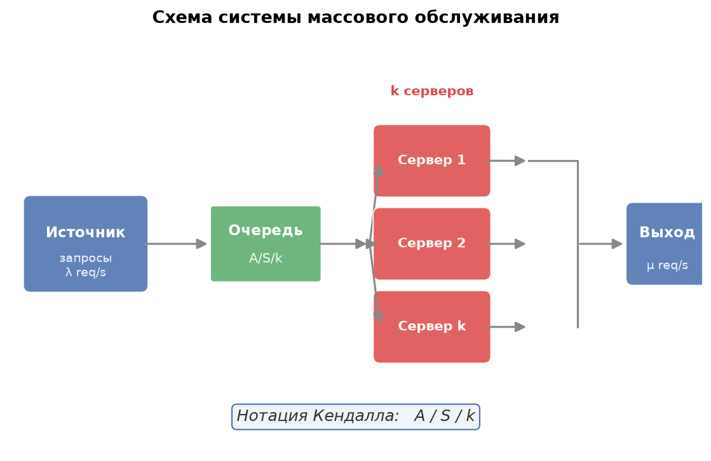
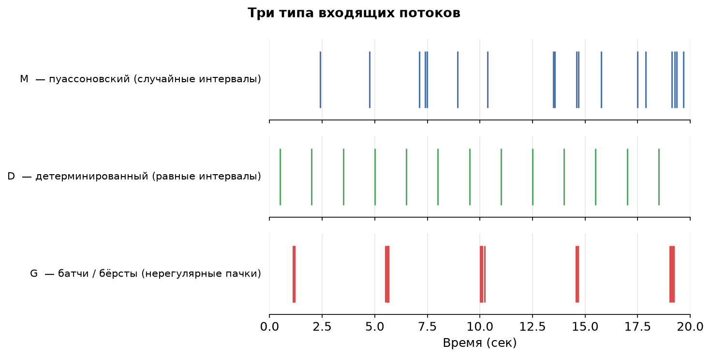
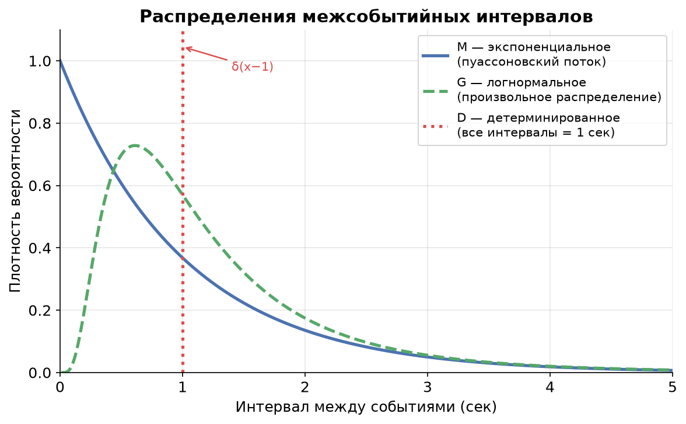

# Урок 3. Нотация Кендалла и классификация систем

> **TL;DR:** Чтобы разговаривать об очередях на одном языке и применять нужные формулы, системы описывают в формате **A/S/k** — три позиции: как приходят запросы, как они обрабатываются и сколько серверов. Основные «буквы»: **M** (случайный пуассоновский поток), **D** (строго по таймеру), **G** (произвольное распределение). Kafka с одним консьюмером и непредсказуемым временем обработки — это **M/G/1**; от этого класса зависит, какие формулы работают.

---

*В уроке 2 мы познакомились с теоремой Литтла и убедились, что закон $L = \lambda W$ работает при любых распределениях. Но «при любых» — это только для среднего. Как только захочется посчитать хвосты, перцентили или оценить, как меняется хвост при росте нагрузки, придётся знать, с каким именно распределением мы имеем дело. Именно здесь в игру вступает нотация Кендалла.*

---

## Зачем нужна единая нотация

Представьте, что коллега говорит: «у нас очередь с одним воркером». Это ничего не говорит о поведении системы. Запросы могут приходить редко и равномерно, а могут взрываться пачками. Воркер может обрабатывать каждый запрос за ровно 50 мс, а может — то за 5 мс, то за 500 мс. Поведение этих систем разительно отличается даже при одинаковой средней нагрузке.

Нотация Кендалла (Kendall's notation) — это трёхсимвольный «паспорт» очереди, который сразу снимает неоднозначность. Она появилась в 1953 году и с тех пор стала общим языком в теории массового обслуживания (queueing theory).

---

## Формат A/S/k

$$A / S / k$$

- **A** — распределение интервалов между приходами запросов (inter-arrival time).
- **S** — распределение времени обслуживания одного запроса (service time).
- **k** — количество серверов (серверов, воркеров, потоков, GPU-слотов — в зависимости от контекста).

Есть расширенные формы вида A/S/k/K/N/D, где K — ёмкость буфера (buffer capacity), N — размер источника запросов, D — дисциплина очереди (FIFO, LIFO, PS). Для курса хватит трёх позиций: именно они определяют тип аналитической модели.

### Схема системы

Запросы приходят из источника с интенсивностью $\lambda$ (запросов в секунду), встают в очередь, затем расходятся по $k$ серверам, каждый из которых тратит на запрос время $S$.

---

## Три типа распределений: M, D, G

### M — марковское, или пуассоновский поток

Буква **M** расшифровывается как «марковское» (Markovian). Для интервалов между приходами это означает экспоненциальное распределение (exponential distribution) с плотностью $f(t) = \lambda e^{-\lambda t}$. Для времени обслуживания — тоже экспоненциальное, только с параметром $\mu$.

Почему «марковское»? Экспоненциальное распределение обладает свойством отсутствия памяти (memoryless property): вероятность завершить обработку в следующую секунду одинакова вне зависимости от того, сколько секунд задача уже выполняется. Это делает систему марковской (Markov chain): её будущее полностью определяется текущим состоянием. Подробнее об этом — в уроке 4.

**Интуиция пуассоновского потока прихода.** Представьте тысячи независимых пользователей, каждый из которых изредка шлёт запрос — скажем, раз в час. Никто из них не координируется с остальными. Тогда суммарный поток запросов подчиняется распределению Пуассона (Poisson process), а интервалы между ними — экспоненциальному. Это фундаментальный результат теории вероятностей: суперпозиция многих редких независимых потоков сходится к пуассоновскому.

**Когда поток НЕ пуассоновский:**

- **Батчи (batch arrivals):** Kafka-продюсер, который складывает сообщения в буфер и раз в 100 мс сбрасывает пачку — явно не пуассоновский.
- **Ретраи (retries):** После ошибки клиент повторяет запрос через фиксированный таймаут. Это создаёт вторичный поток, скоррелированный с первичным.
- **Синхронизированные крон-задачи (cron jobs):** Сотни микросервисов запускают задачу ровно в 00:00 — это залп, а не пуассоновский поток.
- **Тротлинг и rate limiting:** Клиент, упёршийся в лимит, шлёт запросы строго по таймеру — ближе к D, чем к M.

### D — детерминированное

**D** означает детерминированное (deterministic): все интервалы между приходами (или времена обслуживания) строго одинаковы. Это идеальный метроном. Примеры: heartbeat-запросы каждые 10 мс, batch-джобы по расписанию с жёстким интервалом, synthetic monitoring.

### G — общее, или произвольное

**G** означает general — произвольное распределение. Мы не предполагаем ничего: это может быть логнормальное, распределение Парето, смесь двух экспонент или что угодно ещё. Буква G используется, когда реальные данные не укладываются в M или D, или когда хочется получить формулы, верные для любого распределения.

---

## Как «выглядят» три типа потоков

На графике хорошо видна разница:
- **M** — кластеры и пробелы: иногда несколько событий подряд, иногда долгая тишина. Это следствие экспоненциального распределения, у которого нет «памяти» — следующее событие не знает, когда было предыдущее.
- **D** — идеально равномерные тики. Нулевая случайность.
- **G (батчи)** — длинные паузы, затем резкий всплеск: так выглядит буферизованный Kafka-продюсер или синхронизированный крон.

---

## Распределения интервалов: что говорит плотность

- **Экспоненциальное (M):** максимум в нуле, монотонно убывает. Короткие интервалы гораздо вероятнее длинных — именно поэтому пуассоновский поток «кластеризуется».
- **Детерминированное (D):** дельта-функция в одной точке — вся вероятность сосредоточена в одном значении.
- **Логнормальное (G):** мода сдвинута от нуля, хвост тяжелее, чем у экспоненциального. Характерно для времени обработки реальных задач: большинство запросов быстрые, единицы — очень медленные.

---

## Классификация реальных систем: практические примеры

Вот алгоритм классификации: сначала смотрим на природу входящего потока (A), затем на время обработки (S), затем считаем воркеры (k).

### Kafka с одним консьюмером → M/G/1

Представим: в Kafka-топик пишут сотни независимых микросервисов, каждый изредка публикует событие. Это классическая суперпозиция независимых редких потоков — приближение к пуассоновскому. **A = M**.

Консьюмер обрабатывает каждое сообщение: делает вызов в базу, что-то вычисляет, иногда попадает в кэш, иногда нет. Время обработки варьируется — ни экспоненциальное, ни детерминированное. **S = G**.

Один поток-консьюмер. **k = 1**.

Итог: **M/G/1**. Это не просто ярлык — для M/G/1 существует точная формула Поллачека–Хинчина (Pollaczek–Khinchine formula), которую мы разберём в уроке 5.

### ML-инференс сервис с одним GPU → M/G/1

Запросы на инференс приходят от многих независимых клиентов — пуассоновский поток. **A = M**.

Время инференса зависит от размера тензора, типа запроса, теплового состояния GPU. Один запрос обрабатывается 5 мс, другой — 200 мс. Никакой фиксированной величины. **S = G**.

Один GPU-слот (или один воркер на GPU). **k = 1**.

Итог: тоже **M/G/1** — та же модель, что и Kafka. Это и есть смысл нотации: разные физические системы могут иметь одинаковую математическую структуру.

### Synthetic monitoring → D/D/1

Сервис каждые 10 мс отправляет пустой ping-запрос (как SelfPing из итоговой практики курса). Интервал строго детерминирован. **A = D**.

Запрос тривиален — время обработки фиксировано. **S = D**.

Один поток обработки. **k = 1**.

Итог: **D/D/1** — вырожденный случай, нет случайности вообще.

### Пул воркеров для обработки задач → M/G/k

Те же независимые клиенты → **A = M**.

Произвольное время задачи → **S = G**.

Пул из $k$ воркеров (thread pool, процессы, реплики) → **k**.

Итог: **M/G/k**. Масштабирование числом воркеров — это именно переход от M/G/1 к M/G/k.

### Батчевый Kafka-продюсер → G/.../...

Продюсер копит сообщения и сбрасывает пачку каждые 100 мс. Интервалы между пачками детерминированы, но внутри пачки — залп из нескольких сообщений сразу. Это явно не пуассоновский поток, ближе к **G** или **D** для интервалов между пачками. Точная модель зависит от деталей, но однозначно не M/G/1.

---

## Зачем всё это нужно

Нотация Кендалла — не академическая формальность. Она напрямую определяет, какие формулы применимы:

| Класс | Что известно | Что можно посчитать |
|---|---|---|
| M/M/1 | Оба распределения экспоненциальные | Точные замкнутые формулы для всего |
| M/G/1 | Приход пуассоновский, обслуживание произвольное | Формула П-Х: средняя очередь через $E[S]$ и $E[S^2]$ |
| G/G/1 | Всё произвольное | Только аппроксимации и симуляция |
| M/M/k | Оба экспоненциальные, k серверов | Формулы Эрланга (Erlang C/B) |

Когда вы идентифицируете свою систему как M/G/1, вы получаете право использовать формулу Поллачека–Хинчина. Если же поток батчевый (не M) или вы игнорируете тяжёлые хвосты времени обработки (используете M вместо G), формула даст неверный результат, обычно заниженный — вы будете думать, что система справляется, хотя на практике хвосты latency будут расти.

---

## Главное из урока

- Нотация **A/S/k** — трёхбуквенный паспорт системы: тип потока прихода / тип времени обслуживания / число серверов.
- **M** — пуассоновский поток, экспоненциальное распределение, отсутствие памяти. Возникает как суперпозиция многих независимых редких источников.
- **D** — детерминированное: фиксированный таймер, нулевая вариативность.
- **G** — произвольное: ничего не предполагаем, подходит для реальных систем с непредсказуемым временем обработки.
- Пуассоновский поток **не работает** при батчах, синхронизированных кронах, ретраях и тротлинге.
- Kafka с одним консьюмером и ML-инференс с одним GPU — оба **M/G/1**, что позволяет применить одни и те же формулы.
- Класс системы определяет доступный математический аппарат: M/G/1 открывает формулу Поллачека–Хинчина, G/G/1 — только аппроксимации.

---

## Проверь себя

### Вопрос 1
Сервис раз в 5 секунд по таймеру отправляет запрос на проверку здоровья в базу данных. Время ответа БД фиксированное — 2 мс. Как классифицировать эту систему?

- [ ] M/M/1
- [ ] M/G/1
- [x] D/D/1
- [ ] G/G/1

> **Пояснение:** Поток строго детерминирован (каждые 5 секунд) → A = D. Время обслуживания фиксировано (2 мс) → S = D. Один сервер → k = 1. Итого D/D/1. Типичная ошибка — назначить M, потому что «что-то же случайное есть». Но случайности здесь нет ни в потоке, ни в обслуживании.

### Вопрос 2
Kafka-топик, в который пишут 200 независимых микросервисов, каждый в среднем раз в минуту. Консьюмер обрабатывает каждое сообщение: достаёт данные из Redis (иногда кэш-хит — 1 мс, иногда промах — 50 мс). Один поток-консьюмер. Какая нотация?

- [ ] M/M/1
- [x] M/G/1
- [ ] D/G/1
- [ ] G/G/1

> **Пояснение:** 200 независимых редких источников → суперпозиция близка к пуассоновскому потоку → A = M. Время обработки непредсказуемо (зависит от кэш-хита) → S = G, не экспоненциальное. Один воркер → k = 1. Итого M/G/1. Ошибочно назначать M/M/1: время обслуживания не экспоненциальное, оно имеет два режима (кэш-хит / промах).

### Вопрос 3
Что означает «пуассоновский поток» с точки зрения источников запросов?

- [ ] Запросы приходят строго по таймеру с небольшим джиттером
- [ ] Каждый запрос зависит от предыдущего: если предыдущий был быстрый, следующий приходит раньше
- [x] Много независимых клиентов, каждый изредка шлёт запрос; никто не координируется
- [ ] Запросы приходят пачками с экспоненциально распределёнными паузами между пачками

> **Пояснение:** Пуассоновский поток возникает как суперпозиция множества независимых редких источников — это фундаментальная теорема. Ключевые слова: «независимые» и «изредка». Если источники синхронизированы или один источник порождает пачки — это уже не пуассоновский поток.

### Вопрос 4
ML-инференс сервис обслуживает запросы с помощью пула из 4 GPU-воркеров. Запросы приходят от независимых клиентов, время инференса сильно варьируется. Какая нотация?

- [ ] M/G/1
- [ ] M/M/4
- [x] M/G/4
- [ ] G/G/4

> **Пояснение:** Независимые клиенты → A = M. Вариабельное время инференса → S = G (не экспоненциальное). Четыре воркера → k = 4. Итого M/G/4. Ошибочно M/G/1: k отражает реальный параллелизм. Ошибочно M/M/4: экспоненциальное время инференса — сильное упрощение.

### Вопрос 5
Почему класс системы (нотация Кендалла) важен на практике?

- [ ] Он определяет только среднее время отклика; для хвостов класс не важен
- [ ] Все классы дают одинаковые результаты при одинаковой утилизации
- [x] От класса зависит, какие аналитические формулы применимы; неверный класс — неверный прогноз
- [ ] Класс важен только для систем с k > 1

> **Пояснение:** Именно так: формула Поллачека–Хинчина верна только для M/G/1. Если применить её к системе с батчевым потоком (не M) или взять M/M/1 вместо M/G/1 — результат будет ошибочным, обычно оптимистичным. Утилизация $\rho$ одинакова у разных классов, но среднее время в очереди — нет.

### Вопрос 6
Компания настраивает ретраи: при ошибке клиент повторяет запрос ровно через 1 секунду, до 3 раз. Как это влияет на классификацию входящего потока?

- [ ] Никак: ретраи — редкие события, ими можно пренебречь
- [ ] Поток становится детерминированным (D), так как ретраи строго через 1 секунду
- [x] Поток перестаёт быть пуассоновским: ретраи коррелируют с предыдущими запросами и создают всплески
- [ ] Поток становится M/D: основной поток M, ретраи D

> **Пояснение:** Ретраи нарушают ключевое условие пуассоновского потока — независимость событий. После ошибки вероятность нового запроса через 1 секунду резко возрастает. Это создаёт вторичные волны нагрузки, особенно опасные при каскадных сбоях: система перегружена → ошибки → ретраи → ещё больше нагрузки. Такой поток нужно моделировать как G или отдельно учитывать ретраи.

---

## Задачи

### Задача 1
ML-инференс сервис обрабатывает запросы на одном GPU. Среднее время инференса $E[S] = 20$ мс, запросы приходят со средней интенсивностью $\lambda = 40$ запросов в секунду. Вычислите утилизацию сервера $\rho$. Превысит ли система предел устойчивости?

Решение

Утилизация сервера:
$$\rho = \lambda \cdot E[S] = 40 \cdot 0{,}020 = 0{,}8$$

Так как $\rho = 0{,}8 < 1$, система устойчива: в среднем сервер успевает обрабатывать поток.

Но $\rho = 0{,}8$ — это уже высокая нагрузка (80%). Для M/G/1 это означает, что средняя очередь и задержки будут значительными и сильно зависеть от вариативности времени инференса. При $\rho \to 1$ время ожидания стремится к бесконечности — об этом подробнее в уроке 5.

**Ответ:** $\rho = 0{,}8$, система устойчива, но близка к критической нагрузке.

### Задача 2
Перед вами три сервиса. Определите нотацию Кендалла A/S/k для каждого и объясните свой выбор.

1. **Сервис A:** Сотни мобильных клиентов периодически отправляют метрики. Сервер валидирует каждую запись — время валидации зависит от размера payload и составляет от 1 до 200 мс. Один поток обработки.

2. **Сервис B:** Крон-задача запускается ровно каждые 30 секунд и отправляет один запрос в аналитическую БД. Время выполнения запроса стабильно — 500 мс.

3. **Сервис C:** Балансировщик нагрузки распределяет запросы от независимых пользователей по пулу из 8 воркеров. Время обработки у каждого воркера экспоненциально распределено.

Решение

**Сервис A:**
- A = M: сотни независимых мобильных клиентов, каждый изредка шлёт запрос → суперпозиция близка к пуассоновскому потоку.
- S = G: время валидации от 1 до 200 мс — явно не экспоненциальное и не детерминированное, произвольное распределение.
- k = 1: один поток.
- **Нотация: M/G/1.**

**Сервис B:**
- A = D: крон строго каждые 30 секунд → детерминированный поток.
- S = D: время выполнения 500 мс — стабильно, детерминированное.
- k = 1: один запрос.
- **Нотация: D/D/1.**

**Сервис C:**
- A = M: независимые пользователи → пуассоновский поток.
- S = M: экспоненциальное время обработки — прямо указано в условии.
- k = 8: восемь воркеров.
- **Нотация: M/M/8.** Для этого класса применяется формула Эрланга C (Erlang C formula).

---

*В следующем уроке мы подробно разберём свойство отсутствия памяти у экспоненциального распределения — именно оно делает класс M таким удобным математически — и познакомимся с тяжёлыми хвостами, которые являются нормой для реальных систем.*
