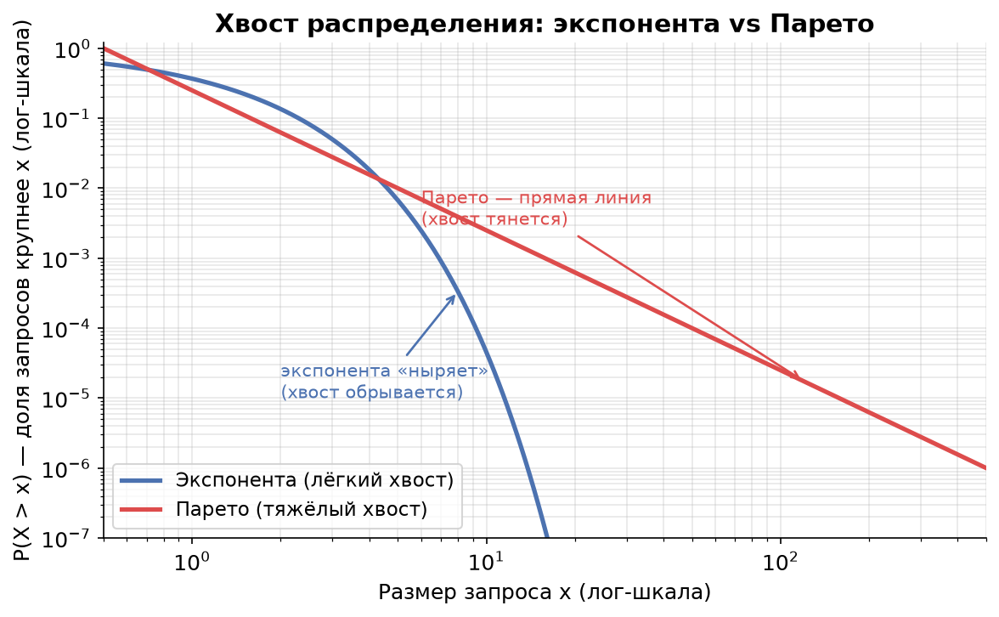
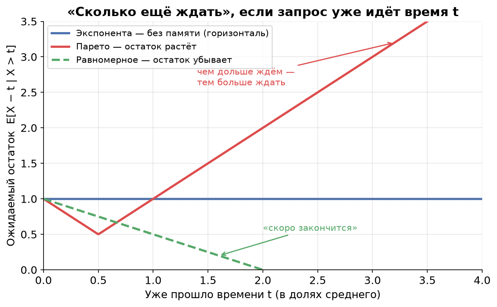
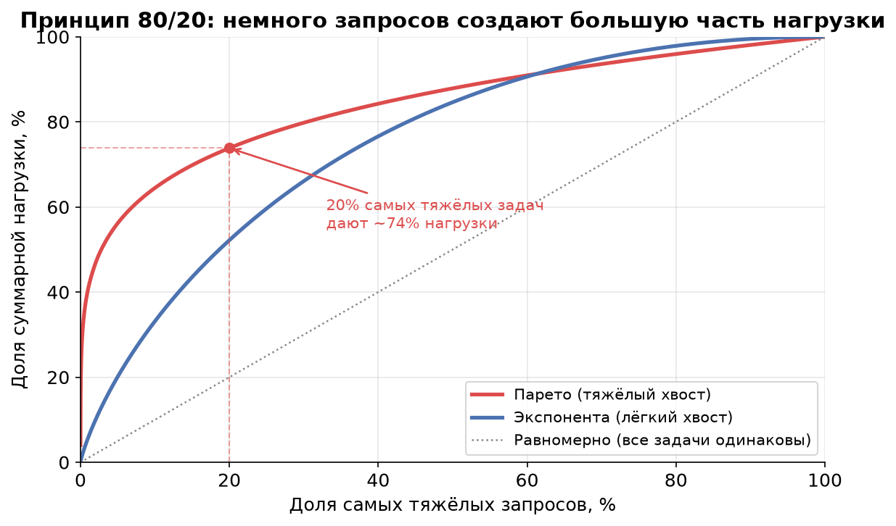

# Урок 4. Свойство «памяти» и тяжёлые хвосты

> **TL;DR:** Экспоненциальное распределение не имеет памяти: сколько бы запрос уже ни выполнялся, ожидаемый остаток одинаков — поэтому M-модели так удобны (марковость). Но в реальных системах размеры файлов, длительности задач и сообщений почти всегда имеют **тяжёлый хвост** (Парето): 20% запросов создают 80% нагрузки, а чем дольше запрос уже идёт, тем БОЛЬШЕ ожидаемый остаток. Отсюда — таймауты, hedged requests, kill-and-restart и культ перцентилей p99 вместо среднего.

В уроке 3 мы научились описывать системы нотацией Кендалла (A/S/k) и встретили букву **M** — марковское, оно же экспоненциальное распределение. Тогда мы просто сказали: «M — это случайное». Теперь разберёмся, почему именно экспонента удобна математикам и насколько она (не)похожа на то, что происходит в настоящих highload-системах.

## Отсутствие памяти: «автобус, который не помнит, сколько вы его ждёте»

Представьте остановку, на которой автобусы ходят «как получится» — без расписания, в среднем раз в 10 минут. Вы стоите уже 10 минут. Вопрос: сколько вам ещё ждать в среднем?

Интуиция кричит: «Раз уже 10 минут прошло — значит вот-вот придёт, осталось чуть-чуть». Но если интервалы между автобусами распределены **экспоненциально**, то правильный ответ — снова в среднем 10 минут. Прошлое ожидание не приближает вас к автобусу ни на секунду.

Это и есть **отсутствие памяти (memorylessness)**. Формально для экспоненциальной случайной величины $X$:

$$P(X > s + t \mid X > t) = P(X > s)$$

Читается так: «при условии, что прождали уже $t$, вероятность прождать ещё хотя бы $s$ — ровно такая же, как если бы мы только что пришли». Распределение «забыло» про уже прошедшее время $t$.

Доказывать не будем (оно прямо следует из того, что $P(X>x)=e^{-\lambda x}$ и свойства $e^{a+b}=e^a e^b$), но покажем смысл на числах. Возьмём $\lambda = 0{,}1$ (в среднем одно событие за 10 минут):

| Уже прождали $t$ | $P(\text{ждать ещё} > 5\text{ мин})$ |
|---|---|
| 0 минут (только пришли) | $e^{-0{,}1\cdot 5} = 0{,}607$ |
| 10 минут | $0{,}607$ |
| 60 минут | $0{,}607$ |

Цифра не меняется. Сколько бы вы ни ждали, шанс прождать ещё пять минут всегда 61%.

### Почему это делает M-модели аналитически удобными

Раз распределение не помнит прошлое, то для предсказания будущего системе достаточно знать **только текущее состояние** — например, сколько запросов сейчас в очереди. Не нужно хранить, когда именно начал обслуживаться текущий запрос или как давно пришёл предыдущий. Это и есть **марковость (Markov property)**: будущее зависит от настоящего, но не от истории.

Благодаря этому M/M-системы сводятся к простым цепям Маркова, для которых есть готовые формулы среднего числа запросов $L$ и времени отклика $W$. Именно поэтому учебники по теории очередей так любят букву M: с ней математика становится решаемой. Плата за удобство — экспонента редко описывает реальные размеры задач. Что мы сейчас и увидим.

## Failure rate: «какова интенсивность завершиться прямо сейчас»

Чтобы сравнивать распределения, введём интуитивное понятие **интенсивности завершения (failure rate / hazard rate)**. Вопрос, на который оно отвечает:

> Запрос уже выполняется $t$ секунд и пока не закончился. Какова интенсивность того, что он завершится **прямо в следующее мгновение**?

Три качественно разных сценария:

- **Экспонента — константный rate.** Интенсивность завершения одинакова в любой момент. Это прямое следствие отсутствия памяти: запросу «всё равно», сколько он уже идёт. «Монетка», которую система подбрасывает каждую секунду, всегда одна и та же.
- **Равномерное / детерминированное — возрастающий rate.** Если вы знаете, что задача длится примерно 50 мс (плюс-минус), то чем дольше она уже идёт, тем ближе неизбежный конец. Интенсивность завершения растёт со временем. У строго детерминированного времени ($D$) она в пределе бесконечна в момент $T$: «ровно через 50 мс, ни раньше, ни позже».
- **Тяжёлый хвост (Парето) — убывающий rate.** Самое контринтуитивное. Чем дольше запрос уже выполняется, тем МЕНЬШЕ интенсивность того, что он завершится сейчас. Долго живущий запрос «доказал», что он из категории гигантов, и, скорее всего, проживёт ещё дольше.

Запомните связку: **убывающий failure rate ⇒ чем дольше уже идёт, тем больше ожидаемый остаток.** Именно это превращает тяжёлые хвосты из абстракции в инженерную головную боль.

## Тяжёлые хвосты и распределение Парето

В компьютерных системах размеры объектов почти никогда не распределены «кучно вокруг среднего». Гораздо чаще работает **принцип 80/20 (правило Парето)**: малая доля запросов создаёт основную часть нагрузки.

- Размеры файлов на диске: большинство мелкие, но пара огромных весит больше, чем все остальные вместе.
- Длительности задач: большинство быстрые, редкие — чудовищно долгие.
- Размеры сообщений в очереди: типичное сообщение — пара килобайт, но иногда прилетает мегабайтный монстр.

Математически это описывает **распределение Парето** с «хвостом»:

$$P(X > x) = \left(\frac{x_m}{x}\right)^{\alpha}, \quad x \ge x_m$$

Здесь $\alpha$ — индекс хвоста: чем он меньше, тем тяжелее хвост. При $\alpha \le 2$ дисперсия бесконечна, при $\alpha \le 1$ бесконечно даже среднее. Это не математическая экзотика — на таких данных обычные «среднее ± стандартное отклонение» просто перестают что-либо значить.

### Визитная карточка тяжёлого хвоста: прямая линия в log-log

Самый наглядный способ отличить тяжёлый хвост — построить **хвостовую функцию** $P(X > x)$ (её называют CCDF, complementary CDF) в логарифмических осях по обеим координатам.

У экспоненты $P(X>x)=e^{-\lambda x}$ — в log-log она резко «ныряет» вниз: вероятность встретить запрос вдвое крупнее среднего ещё заметна, а вчетверо крупнее — уже практически ноль. Хвост обрывается.

У Парето $\log P(X>x) = \alpha\,(\log x_m - \log x)$ — это **прямая линия** с наклоном $-\alpha$. Хвост не обрывается, а тянется: запросы в 10, 100, 1000 раз крупнее среднего редки, но встречаются регулярно. Прямая в log-log — фирменный признак тяжёлого хвоста, по которому его узнают в данных мониторинга.

### Чем дольше идёт — тем больше ждать

Сравним для трёх распределений **ожидаемый остаток** $E[X - t \mid X > t]$: «запрос уже идёт время $t$ и не закончился — сколько ещё в среднем ждать?». Все три нормированы на одно и то же среднее, чтобы сравнение было честным.

- **Экспонента (синяя) — горизонталь.** Остаток всегда равен среднему, независимо от $t$. Тот самый автобус без памяти.
- **Равномерное (зелёное) — убывает к нулю.** Чем дольше задача идёт, тем ближе её конец. «Ещё чуть-чуть» здесь работает.
- **Парето (красная) — растёт.** Чем дольше запрос уже выполняется, тем БОЛЬШЕ ожидаемый остаток. Запрос, проработавший минуту, в среднем проработает ещё дольше, чем тот, что только стартовал.

Та самая интуиция про автобус («уже долго жду — значит скоро») верна для равномерного, бессмысленна для экспоненты и **в точности наоборот** для тяжёлого хвоста.

### Сколько весят самые тяжёлые

А вот тот самый принцип 80/20 в явном виде. По горизонтали — доля самых тяжёлых запросов, по вертикали — какую долю суммарной нагрузки (суммарного времени обслуживания, байтов) они создают.

Для тяжёлого хвоста (красная) даже малая доля крупнейших запросов забирает львиную долю работы: ~20% самых тяжёлых дают около 75–80% нагрузки. У экспоненты (синяя) перекос куда мягче, а у гипотетического «все задачи одинаковы» вообще нет хвоста — диагональ. Эта картинка объясняет, почему один залётный гигант способен «съесть» весь GPU или забить консьюмера: он один весит как тысячи обычных запросов.

## Практические следствия: что с этим делать инженеру

Тяжёлые хвосты переворачивают несколько привычных интуиций.

**«Подождём ещё чуть-чуть, наверняка вот-вот закончится» — плохая стратегия.** При убывающем failure rate всё ровно наоборот: чем дольше запрос висит, тем дольше он, скорее всего, ещё провисит. Ожидание не приближает развязку, а отодвигает её.

**Нужны таймауты.** Раз долгие запросы склонны затягиваться ещё сильнее, разумно их обрывать. Таймаут отсекает хвост: вместо того чтобы бесконечно ждать гиганта, мы фиксируем верхнюю границу и освобождаем ресурс.

**Hedged requests (отправить дубль).** Если запрос подозрительно долго не отвечает, отправляем его копию на другой сервер и берём того, кто ответит первым. При тяжёлом хвосте это особенно выгодно: «зависший» запрос вероятнее всего попал в неудачный хвост, а свежий дубль с большой вероятностью отработает быстро. Цена — небольшой рост общей нагрузки ради резкого улучшения p99.

**Kill-and-restart.** Иногда выгоднее убить затянувшуюся задачу и запустить её заново, чем ждать. Перезапущенная задача стартует «с нуля» хвоста и, скорее всего, окажется одной из быстрых — ведь большинство запросов лёгкие.

**Среднее обманчиво — нужны перцентили.** При тяжёлом хвосте среднее тащат вверх редкие гиганты, и оно перестаёт описывать «типичный» запрос. Медиана может быть 5 мс, а среднее — 50 мс из-за одного запроса в секунду на 5 секунд. Поэтому в highload смотрят не на average, а на **перцентили: p50, p99, p99.9**. p99 = 200 мс означает «99% запросов укладываются в 200 мс», и именно его чувствует пользователь, которому не повезло попасть в хвост.

## Где это встречается: три примера

- **ML-инференс.** Большинство запросов лёгкие (короткий промпт, маленький тензор), но изредка прилетает запрос с гигантским контекстом или длинной генерацией, который занимает GPU в сотни раз дольше. Один такой «слон» в очереди FIFO задерживает всех, кто стоит за ним, — отсюда таймауты и hedging на инференс-серверах.
- **Паузы сборщика мусора (GC).** Длительности GC-пауз — классический тяжёлый хвост: обычно микросекунды, но изредка stop-the-world на сотни миллисекунд. Среднее время паузы выглядит безобидно, а p99.9 портит latency всему сервису. Поэтому GC настраивают и измеряют именно по хвостовым перцентилям.
- **Размеры сообщений в Kafka.** Типичное сообщение — единицы килобайт, но в тот же топик иногда летит мегабайтный батч. Консьюмер с фиксированным `max.poll.records` внезапно получает «тяжёлый» poll и отстаёт — растёт consumer lag (с ним мы ещё встретимся). Один большой объект перекашивает и трафик, и время обработки.

## Главное из урока

- **Отсутствие памяти:** $P(X > s + t \mid X > t) = P(X > s)$. Экспонента «забывает» прошлое — ожидаемый остаток не зависит от уже прошедшего времени.
- Отсутствие памяти даёт **марковость**: будущее зависит только от текущего состояния системы. Поэтому M-модели аналитически удобны — но реальные размеры задач они описывают плохо.
- **Failure rate** (интенсивность завершения): у экспоненты — константный, у равномерного/детерминированного — возрастающий, у тяжёлого хвоста — **убывающий**.
- **Тяжёлый хвост (Парето):** малая доля запросов создаёт большую часть нагрузки (80/20). В log-log осях хвост $P(X>x)$ — прямая линия.
- При тяжёлом хвосте **чем дольше запрос уже идёт, тем больше ожидаемый остаток** — интуиция «вот-вот закончится» вредна.
- Практические приёмы: **таймауты, hedged requests, kill-and-restart**. Среднее обманчиво — измеряем **перцентили p99/p99.9**.
- Примеры тяжёлых хвостов: ML-инференс, GC-паузы, размеры сообщений в Kafka.

В уроке 5 мы увидим, как именно эта **вариативность** размеров задач (а тяжёлый хвост — это экстремальная вариативность) бьёт по времени ожидания в очереди через формулу Поллачека — Хинчина: почему систему с разнородными задачами нельзя нагружать так же смело, как с одинаковыми.

## Проверь себя

### Вопрос 1
Автобусы приходят с экспоненциально распределёнными интервалами, в среднем раз в 10 минут. Вы ждёте уже 10 минут. Сколько в среднем осталось ждать?

- [ ] Около 0 минут — автобус вот-вот придёт
- [ ] Около 5 минут — половину уже прождали
- [x] В среднем 10 минут — столько же, сколько вначале
- [ ] Зависит от того, сколько автобусов прошло раньше

> **Пояснение:** Это ловушка интуиции «уже долго жду — значит скоро». Экспоненциальное распределение не имеет памяти: $P(X > 10 + t \mid X > 10) = P(X > t)$. Прошедшие 10 минут ничего не меняют — ожидаемый остаток снова равен среднему, то есть 10 минутам. Вариант «вот-вот придёт» был бы верен для распределения с возрастающим failure rate (например, равномерного или детерминированного), но не для экспоненты.

### Вопрос 2
Что означает «убывающий failure rate» у распределения с тяжёлым хвостом?

- [ ] Чем дольше запрос выполняется, тем скорее он завершится
- [x] Чем дольше запрос выполняется, тем больше его ожидаемый остаток
- [ ] Запросы всегда завершаются за фиксированное время
- [ ] Интенсивность завершения не зависит от прошедшего времени

> **Пояснение:** Убывающий failure rate значит, что интенсивность завершения падает со временем: долго живущий запрос «доказал», что он из категории гигантов, и проживёт, скорее всего, ещё дольше. Вариант про «скорее завершится» — это возрастающий rate (равномерное/детерминированное). Вариант «не зависит от времени» — это константный rate экспоненты.

### Вопрос 3
Как выглядит хвост $P(X > x)$ распределения Парето в осях log-log (логарифм по обеим осям)?

- [ ] Резко падает («ныряет») вниз
- [x] Прямая линия с отрицательным наклоном
- [ ] Горизонтальная линия
- [ ] Растущая кривая

> **Пояснение:** Для Парето $\log P(X>x) = \alpha(\log x_m - \log x)$ — это прямая с наклоном $-\alpha$. Прямая в log-log — фирменный признак тяжёлого хвоста. «Ныряет вниз» — это экспонента (лёгкий хвост): её хвост обрывается куда быстрее.

### Вопрос 4
Почему отсутствие памяти у экспоненциального распределения делает M-модели удобными для анализа?

- [ ] Потому что экспонента точно описывает размеры задач в реальных системах
- [ ] Потому что у экспоненты нет дисперсии
- [x] Потому что будущее зависит только от текущего состояния (марковость), и историю хранить не нужно
- [ ] Потому что экспоненциальные запросы всегда обрабатываются быстрее

> **Пояснение:** Отсутствие памяти влечёт марковость: чтобы предсказать будущее, достаточно знать текущее состояние (сколько запросов в очереди), а не всю историю. Это сводит систему к простой цепи Маркова с готовыми формулами. При этом экспонента как раз плохо описывает реальные размеры задач — там обычно тяжёлый хвост.

### Вопрос 5
Сервис инференса показывает среднее время ответа 40 мс, но при этом медиана (p50) всего 8 мс. О чём это говорит?

- [ ] В измерениях ошибка: медиана не может быть меньше среднего
- [x] У распределения тяжёлый хвост — редкие гигантские запросы тянут среднее вверх
- [ ] Все запросы примерно одинаковы по длительности
- [ ] Сервис работает идеально, оптимизация не нужна

> **Пояснение:** Когда среднее сильно больше медианы, это классический признак тяжёлого хвоста: большинство запросов быстрые (медиана 8 мс), но редкие гиганты вытягивают среднее до 40 мс. Медиана вполне может быть меньше среднего — это нормально для асимметричных распределений. Именно поэтому в highload смотрят на перцентили (p99, p99.9), а не на среднее.

### Вопрос 6
Запрос к сервису висит подозрительно долго. Почему при тяжёлом хвосте разумнее отправить дубль (hedged request) или перезапустить, а не просто ждать?

- [ ] Потому что долгий запрос вот-вот завершится, и дубль успеет «подстраховать»
- [x] Потому что долгий запрос, скорее всего, попал в хвост и провисит ещё дольше, а свежий запрос вероятнее всего быстрый
- [ ] Потому что ожидание увеличивает нагрузку на сеть
- [ ] Потому что таймауты запрещены в распределённых системах

> **Пояснение:** При убывающем failure rate уже долго висящий запрос с большой вероятностью «гигант» и провисит ещё дольше. А новый дубль стартует с начала хвоста и, поскольку большинство запросов лёгкие, скорее всего отработает быстро. Поэтому hedging и kill-and-restart улучшают p99. Вариант «вот-вот завершится» — это снова та же ловушка интуиции.

## Задачи

### Задача 1
Время обработки запроса на GPU распределено экспоненциально со средним 20 мс. Запрос уже обрабатывается 30 мс и пока не завершён.

1. Какова вероятность, что он будет обрабатываться ещё хотя бы 20 мс (то есть суммарно больше 50 мс)?
2. Сравните её с вероятностью, что только что пришедший запрос займёт больше 20 мс. Что вы заметили?

Решение

Среднее время обслуживания 20 мс ⇒ интенсивность $\mu = 1/20 = 0{,}05$ мс⁻¹. Хвостовая функция экспоненты: $P(X > x) = e^{-\mu x}$.

**Пункт 1.** Нужна условная вероятность $P(X > 50 \mid X > 30)$. По свойству отсутствия памяти:

$$P(X > 50 \mid X > 30) = P(X > 20) = e^{-0{,}05 \cdot 20} = e^{-1} \approx 0{,}368$$

(Можно проверить и «в лоб»: $P(X>50\mid X>30) = \dfrac{P(X>50)}{P(X>30)} = \dfrac{e^{-2{,}5}}{e^{-1{,}5}} = e^{-1} \approx 0{,}368$.)

**Пункт 2.** Для только что пришедшего запроса:

$$P(X > 20) = e^{-0{,}05 \cdot 20} = e^{-1} \approx 0{,}368$$

Вероятности **совпадают** — 36,8%. То, что запрос уже отработал 30 мс, никак не влияет на его будущее: распределение не помнит прошлого. Если бы время обслуживания имело тяжёлый хвост, условная вероятность «ещё 20 мс» была бы заметно выше — долгий запрос склонен затягиваться.

**Ответ:** обе вероятности равны $e^{-1} \approx 0{,}368$ (36,8%).

### Задача 2
В топик Kafka летят сообщения. Их размеры распределены по Парето с $x_m = 1$ КБ и индексом хвоста $\alpha = 1{,}5$.

1. Какая доля сообщений крупнее 8 КБ?
2. Во сколько раз сообщения крупнее 8 КБ встречаются реже, чем крупнее 2 КБ?

Решение

Хвостовая функция Парето: $P(X > x) = \left(\dfrac{x_m}{x}\right)^{\alpha} = \left(\dfrac{1}{x}\right)^{1{,}5}$ (размер в КБ).

**Пункт 1.** Доля сообщений крупнее 8 КБ:

$$P(X > 8) = \left(\frac{1}{8}\right)^{1{,}5} = 8^{-1{,}5} = \frac{1}{8\sqrt{8}} = \frac{1}{22{,}6} \approx 0{,}044$$

То есть примерно **4,4%** сообщений крупнее 8 КБ. Хвост тяжёлый: даже размер в 8 раз больше базового встречается у каждого ~23-го сообщения.

**Пункт 2.** Доля крупнее 2 КБ:

$$P(X > 2) = \left(\frac{1}{2}\right)^{1{,}5} = 2^{-1{,}5} = \frac{1}{2\sqrt{2}} \approx 0{,}354$$

Отношение:

$$\frac{P(X>8)}{P(X>2)} = \frac{8^{-1{,}5}}{2^{-1{,}5}} = \left(\frac{2}{8}\right)^{1{,}5} = \left(\frac{1}{4}\right)^{1{,}5} = \frac{1}{8} = 0{,}125$$

Сообщения крупнее 8 КБ встречаются в **8 раз** реже, чем крупнее 2 КБ. Для сравнения: у экспоненты с тем же масштабом рост размера давал бы экспоненциальное (гораздо более резкое) падение частоты — а здесь убывание степенное, и крупные сообщения остаются вполне реальными.

**Ответ:** (1) ≈ 4,4% сообщений крупнее 8 КБ; (2) в 8 раз реже.

