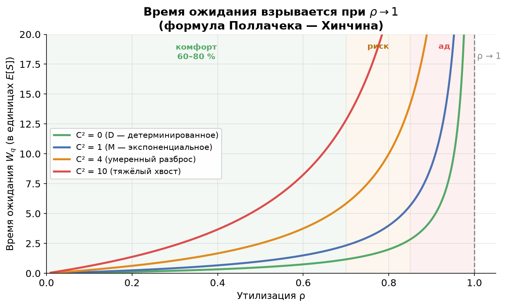
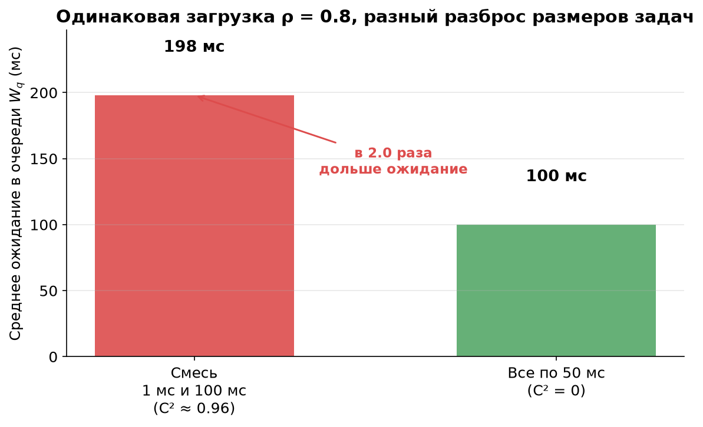
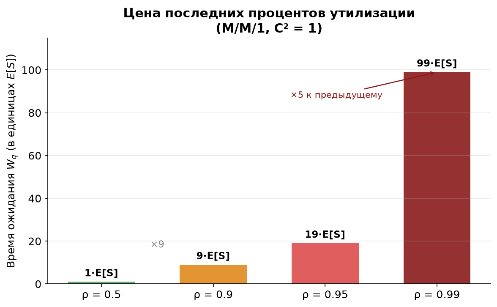

# Урок 5. Эффект утилизации и формула Поллачека — Хинчина

> **TL;DR:** Время ожидания в очереди растёт не линейно, а **взрывообразно**: при загрузке $\rho \to 1$ оно стремится к бесконечности. Поэтому highload-системы держат на 60–80 %, а не на 95 %. Формула Поллачека — Хинчина показывает, что ожидание складывается из двух множителей — **фактора загрузки** $\rho/(1-\rho)$ и **фактора вариативности** $(1+C_s^2)/2$. Чтобы снизить latency, можно тянуть за любой из двух рычагов: уменьшать загрузку или уменьшать разброс размеров задач.

В уроке 3 мы научились описывать системы нотацией Кендалла (M/M/1, M/G/1, M/D/1), а в уроке 4 разобрались, почему у времени обслуживания бывает «тяжёлый хвост» и большой разброс. Теперь соберём это вместе и ответим на главный практический вопрос курса: **как загрузка и разброс размеров задач превращаются в задержку**.

## Утилизация: сколько процентов мощности «занято»

**Утилизация (utilization)** — это доля времени, в течение которой сервер занят работой:

$$\rho = \frac{\lambda}{\mu} = \lambda \cdot E[S].$$

Здесь $\lambda$ — интенсивность входящего потока (запросов в секунду), $\mu$ — интенсивность обслуживания (сколько запросов в секунду сервер может «переварить»), а $E[S] = 1/\mu$ — среднее время обслуживания одного запроса. Если на GPU-сервис приходит 80 запросов в секунду, а один запрос обрабатывается в среднем за 10 мс (то есть сервер способен на 100 req/s), то $\rho = 80/100 = 0{,}8$ — сервер занят 80 % времени.

Кажется логичным: раз мы платим за дорогой GPU, давайте загрузим его на 95–100 %, чтобы «не простаивал». Это и есть главная ловушка. **Чем ближе $\rho$ к единице, тем катастрофичнее растёт время ожидания в очереди.**

### Интуиция: запас на разгребание всплесков

Представьте кассу супермаркета. Покупатели приходят неравномерно — то пусто, то вдруг подошли пятеро сразу. Пока касса загружена на 50 %, у неё есть «запас»: после всплеска она быстро разгребает накопившуюся очередь в простойные минуты. Но если касса занята 99 % времени, свободной мощности почти не остаётся — каждый случайный всплеск копится, а разгрести его нечем. Очередь растёт быстрее, чем рассасывается.

Формально: загрузка $\rho$ — это *средняя* величина. Реальный поток случаен (как мы видели в уроке 3, пуассоновский поток даёт неравномерные интервалы). Свободные «дырки» во времени ($1-\rho$) — это и есть ресурс, которым система рассасывает накопленные всплески. Когда $1-\rho \to 0$, ресурса не остаётся, и очередь уходит в бесконечность.

## Формула Поллачека — Хинчина

Для системы **M/G/1** (пуассоновский входящий поток, *произвольное* распределение времени обслуживания, один сервер) среднее время ожидания в очереди даётся формулой **Поллачека — Хинчина (Pollaczek–Khinchine)**:

$$W_q = \underbrace{\frac{\rho}{1-\rho}}_{\text{фактор загрузки}} \cdot \underbrace{\frac{E[S]\,(1 + C_s^2)}{2}}_{\text{фактор вариативности}}.$$

Здесь $C_s^2$ — квадрат коэффициента вариации времени обслуживания:

$$C_s^2 = \frac{\operatorname{Var}(S)}{E[S]^2} = \frac{E[S^2]}{E[S]^2} - 1.$$

Это безразмерная мера разброса: $C_s^2 = 0$ означает, что все запросы строго одинаковы (детерминированное обслуживание, тип **D**), $C_s^2 = 1$ — экспоненциальное распределение (тип **M**), а $C_s^2 > 1$ — «рваное» обслуживание с тяжёлым хвостом (тип **G**, как в уроке 4).

Вывод формулы мы опускаем — он не добавляет интуиции. Важны **условия применимости**: формула верна для одного сервера, пуассоновского входящего потока и стационарного режима ($\rho < 1$, иначе очередь не имеет предела). Разберём по множителям.

### Множитель 1: фактор загрузки $\rho/(1-\rho)$

Это «взрывная» часть. Посмотрите, как он себя ведёт:

| $\rho$ | $\rho/(1-\rho)$ |
|-------:|----------------:|
| 0,5    | 1               |
| 0,8    | 4               |
| 0,9    | 9               |
| 0,95   | 19              |
| 0,99   | 99              |

При переходе с 50 % на 90 % загрузки ожидание растёт в **9 раз**, а на участке 0,95 → 0,99 — ещё в **5 раз**. Это и есть та самая «хоккейная клюшка»: знаменатель $1-\rho$ обнуляется, и дробь уходит в бесконечность.

На графике зоны подсвечены: «комфорт» (60–80 %, плоская часть), «риск» (80–85 %) и «ад» (выше 85 %, где кривая встаёт вертикально). Обратите внимание: до $\rho \approx 0{,}7$ все кривые идут почти полого — добавление нагрузки почти не стоит latency. А вот после 0,85 любая из них взлетает.

### Множитель 2: фактор вариативности $(1 + C_s^2)/2$

Это постоянный множитель, зависящий только от разброса размеров задач:

- $C_s^2 = 0$ (тип **D**): множитель $= (1+0)/2 = 0{,}5$;
- $C_s^2 = 1$ (тип **M**): множитель $= (1+1)/2 = 1$;
- $C_s^2 = 4$: множитель $= 2{,}5$;
- $C_s^2 = 10$ (тяжёлый хвост): множитель $= 5{,}5$.

Он линейно умножает всю очередь. Запрос ждёт дольше не из-за средней скорости, а из-за **разброса**: если впереди него встал один «толстый» запрос, ждать придётся долго всем за ним.

## Вариативность важнее, чем кажется: пример 1 мс / 100 мс

Возьмём сквозной пример ML-инференса. Сервис на GPU обрабатывает запросы, загрузка фиксирована: $\rho = 0{,}8$. Сравним два сценария при **одинаковой загрузке**.

**Сценарий A — смесь.** Половина запросов — лёгкие, по 1 мс (короткий тензор), половина — тяжёлые, по 100 мс (большая картинка). Считаем честно:

$$E[S] = 0{,}5 \cdot 1 + 0{,}5 \cdot 100 = 50{,}5\ \text{мс};$$
$$E[S^2] = 0{,}5 \cdot 1^2 + 0{,}5 \cdot 100^2 = 5000{,}5\ \text{мс}^2;$$
$$C_s^2 = \frac{E[S^2]}{E[S]^2} - 1 = \frac{5000{,}5}{50{,}5^2} - 1 = \frac{5000{,}5}{2550{,}25} - 1 \approx 0{,}96.$$

$$W_q^{A} = \frac{0{,}8}{1-0{,}8} \cdot \frac{50{,}5 \cdot (1 + 0{,}96)}{2} = 4 \cdot \frac{50{,}5 \cdot 1{,}96}{2} \approx 4 \cdot 49{,}5 \approx 198\ \text{мс}.$$

**Сценарий B — все одинаковые.** Все запросы строго по 50 мс (детерминированное обслуживание, $C_s^2 = 0$). Средняя нагрузка та же:

$$W_q^{B} = \frac{0{,}8}{1-0{,}8} \cdot \frac{50 \cdot (1 + 0)}{2} = 4 \cdot 25 = 100\ \text{мс}.$$

Разброс размеров задач удвоил среднее ожидание (**198 мс против 100 мс**) — при абсолютно той же средней нагрузке на GPU. И это ещё мягкий случай: $C_s^2 \approx 0{,}96$ почти как у экспоненты. Если бы смесь была более «рваной» (скажем, 99 % по 1 мс и 1 % по 1000 мс), $C_s^2$ улетел бы за десятки, и ожидание выросло бы кратно — это та самая зона тяжёлых хвостов из урока 4.

> **Почему так.** Когда в очередь перед вами встаёт один «толстый» 100-миллисекундный запрос, вы и все за вами теряете эти 100 мс целиком. Усреднение по «лёгким» соседям не спасает: редкие тяжёлые задачи раздувают $E[S^2]$ квадратично, а именно $E[S^2]$ (через $C_s^2$) и сидит в числителе формулы.

## M/M/1 против M/D/1: детерминизм вдвое короче очередь

Это прямое следствие формулы. Возьмём два сервиса с одинаковой загрузкой и одинаковым средним временем обслуживания $E[S]$, отличающихся только разбросом:

- **M/M/1** ($C_s^2 = 1$): фактор вариативности $= 1$, значит $W_q = \dfrac{\rho}{1-\rho} \cdot E[S]$;
- **M/D/1** ($C_s^2 = 0$): фактор вариативности $= 0{,}5$, значит $W_q = \dfrac{\rho}{1-\rho} \cdot \dfrac{E[S]}{2}$.

**Детерминированное обслуживание сокращает очередь ровно вдвое** по сравнению с экспоненциальным — при той же средней скорости и той же загрузке. Просто потому, что задачи перестали «прыгать» по размеру. Это бесплатное ускорение, если вы можете сделать обработку предсказуемой по времени.

## Цена последних процентов

Соедините оба эффекта — и станет ясно, почему инженеры highload не гонятся за 100 % загрузки. Возьмём M/M/1: ожидание (в единицах $E[S]$) равно $\rho/(1-\rho)$.

- Поднять загрузку с 50 % до 90 % — ожидание выросло в 9 раз;
- с 95 % до 99 % — ещё в 5 раз.

Последние проценты утилизации — самые дорогие по latency. Вы экономите немного «железа», но платите за это десятикратным ростом задержки и полной потерей устойчивости к всплескам.

## Практические выводы: два рычага latency

Формула Поллачека — Хинчина даёт ровно **два рычага** для управления задержкой — по числу множителей.

**Рычаг 1 — снижать загрузку $\rho$.** Целевая утилизация highload-сервисов обычно **60–80 %**, а не 95 %. Это не «лень» и не «пустая трата ресурсов» — это запас мощности, которым система разгребает случайные всплески (микробёрсты — тема урока 6). На графике-клюшке видно: до 0,8 кривая ещё пологая, после — вертикаль. Снизить $\rho$ можно, добавив серверов/реплик или ускорив обработку.

**Рычаг 2 — снижать вариативность $C_s^2$.** Часто он дешевле первого, потому что не требует нового железа:

- **Батчинг одинаковых задач.** Группируйте однотипные запросы — обработка становится предсказуемой по времени, $C_s^2$ падает.
- **Разделение «лёгких» и «тяжёлых» в разные пулы/очереди.** Если в примере 1 мс/100 мс развести лёгкие и тяжёлые запросы по двум отдельным очередям, внутри каждой $C_s^2$ резко уменьшится — и короткие запросы перестанут ждать за толстыми (тот самый эффект «не стой за человеком с полной тележкой на экспресс-кассе»).
- **Ограничение максимального размера задачи.** Отрезав хвост (лимит на размер тензора, разбивка большого запроса на части — как в уроке 1), вы уменьшаете $E[S^2]$ и стабилизируете $C_s^2$.

Главная мысль: **latency — это не только про среднюю скорость**. Два сервиса с одинаковой средней нагрузкой и одинаковой средней скоростью обработки могут отличаться по времени ожидания в разы — всё решает предсказуемость.

Формула Поллачека — Хинчина оперирует *средними* величинами и предполагает стационарный пуассоновский поток. Но что, если средняя загрузка низкая (50 %), а система всё равно тормозит? Это бывает из-за кратковременных всплесков — **микробёрстов**, которые не видны на графиках мониторинга. Ими и «парадоксом времени ожидания» займёмся в уроке 6.

## Главное из урока

- **Утилизация** $\rho = \lambda/\mu = \lambda E[S]$ — доля времени, когда сервер занят. Свободная доля $1-\rho$ — это ресурс, которым система разгребает всплески.
- Время ожидания растёт **нелинейно**: фактор загрузки $\rho/(1-\rho)$ стремится к бесконечности при $\rho \to 1$ («хоккейная клюшка»). Последние проценты загрузки — самые дорогие.
- **Формула Поллачека — Хинчина** для M/G/1: $W_q = \dfrac{\rho}{1-\rho}\cdot\dfrac{E[S](1+C_s^2)}{2}$ — произведение фактора загрузки и фактора вариативности.
- Время ожидания зависит **не только от средней скорости, но и от разброса** размеров задач ($C_s^2$). Смесь 1 мс / 100 мс даёт ~198 мс ожидания против 100 мс для всех-по-50-мс при той же загрузке.
- **M/D/1 вдвое короче, чем M/M/1**: детерминированное обслуживание ($C_s^2=0$) сокращает очередь в 2 раза относительно экспоненциального ($C_s^2=1$).
- Два рычага latency: **снижать $\rho$** (держать 60–80 %, добавлять мощность) или **снижать $C_s^2$** (батчинг, разделение лёгких/тяжёлых очередей, лимит на размер задачи).

## Проверь себя

### Вопрос 1
Сервис загружен на $\rho = 0{,}9$. Во сколько раз вырастет среднее время ожидания $W_q$, если поднять загрузку до $\rho = 0{,}95$ (при том же распределении обслуживания)?

- [ ] Примерно в 1,05 раза — пропорционально росту загрузки
- [x] Примерно в 2,1 раза
- [ ] В 5 раз
- [ ] Не изменится — $W_q$ зависит только от $C_s^2$

> **Пояснение:** Фактор загрузки $\rho/(1-\rho)$ равен $0{,}9/0{,}1 = 9$ при $\rho=0{,}9$ и $0{,}95/0{,}05 = 19$ при $\rho=0{,}95$. Отношение $19/9 \approx 2{,}1$. Рост загрузки всего на 5 процентных пунктов удваивает ожидание — в этом и состоит нелинейность. Вариант «пропорционально» — типичная ошибка линейного мышления.

### Вопрос 2
Два сервиса имеют одинаковую загрузку $\rho$ и одинаковое среднее время обслуживания $E[S]$. У первого $C_s^2 = 0$ (M/D/1), у второго $C_s^2 = 1$ (M/M/1). Что верно?

- [ ] Время ожидания одинаковое, ведь $E[S]$ и $\rho$ совпадают
- [x] У M/D/1 ожидание в очереди вдвое меньше, чем у M/M/1
- [ ] У M/D/1 ожидание вдвое больше
- [ ] Сравнить нельзя без знания $\lambda$

> **Пояснение:** Фактор вариативности равен $(1+0)/2 = 0{,}5$ для D и $(1+1)/2 = 1$ для M. При прочих равных детерминированное обслуживание даёт ровно вдвое меньшую очередь. Одинаковое $E[S]$ не означает одинаковое ожидание — разброс $C_s^2$ решает.

### Вопрос 3
Почему highload-сервисы обычно держат целевую утилизацию 60–80 %, а не 95–100 %?

- [ ] Потому что выше 80 % сервер физически не справляется с обработкой
- [ ] Чтобы экономить электроэнергию
- [x] Потому что свободная доля мощности $1-\rho$ нужна, чтобы рассасывать случайные всплески; при $\rho \to 1$ ожидание уходит в бесконечность
- [ ] Потому что формула P-K не работает при $\rho > 0{,}8$

> **Пояснение:** Сервер физически способен работать и при 99 %, формула применима при любом $\rho < 1$. Проблема в том, что запас $1-\rho$ — это ресурс для разгребания всплесков. При $\rho \to 1$ запас исчезает и $W_q \to \infty$. Это вопрос устойчивости к случайности, а не физического предела.

### Вопрос 4
В примере «1 мс / 100 мс» среднее время обслуживания $E[S] = 50{,}5$ мс, что почти как у «всех по 50 мс». Тем не менее ожидание вдвое больше. Что главным образом это объясняет?

- [ ] Большее $E[S]$ (50,5 против 50)
- [x] Большой второй момент $E[S^2]$: редкие тяжёлые запросы по 100 мс раздувают $C_s^2$
- [ ] Более высокая загрузка $\rho$ в смешанном сценарии
- [ ] Пуассоновский входящий поток в одном случае и нет — в другом

> **Пояснение:** Разница в $E[S]$ ничтожна (50,5 против 50). Загрузка зафиксирована одинаковой. Дело в $C_s^2$: тяжёлые запросы по 100 мс входят в $E[S^2]$ квадратично, поднимая $C_s^2$ почти до 1, тогда как у детерминированного случая $C_s^2 = 0$. Именно второй момент, а не среднее, управляет очередью.

### Вопрос 5
Команда хочет снизить latency инференс-сервиса, не докупая GPU. Какой приём напрямую уменьшает фактор вариативности $(1+C_s^2)/2$?

- [ ] Поднять $\lambda$, чтобы запросы не простаивали
- [ ] Увеличить размер каждого тензора
- [x] Развести лёгкие и тяжёлые запросы по отдельным очередям/пулам
- [ ] Уменьшить число серверов

> **Пояснение:** Разделение лёгких и тяжёлых запросов делает каждую очередь более однородной — внутри неё $C_s^2$ падает, и лёгкие запросы перестают ждать за толстыми. Поднятие $\lambda$ увеличивает $\rho$ (хуже), уменьшение серверов тоже растит $\rho$, а увеличение тензоров растит $E[S]$ и разброс.

### Вопрос 6
При каких условиях формула Поллачека — Хинчина $W_q = \frac{\rho}{1-\rho}\cdot\frac{E[S](1+C_s^2)}{2}$ применима?

- [ ] Для любого числа серверов $k$ и любого входящего потока
- [x] Один сервер, пуассоновский входящий поток, произвольное обслуживание, $\rho < 1$
- [ ] Только для экспоненциального обслуживания (M/M/1)
- [ ] Только для детерминированного обслуживания (M/D/1)

> **Пояснение:** P-K — это формула для системы **M/G/1**: один сервер, пуассоновский (марковский) входящий поток, *произвольное* распределение обслуживания. M/M/1 и M/D/1 — её частные случаи ($C_s^2 = 1$ и $C_s^2 = 0$). Для нескольких серверов или непуассоновского потока нужны другие (приближённые) формулы. Условие $\rho < 1$ обязательно — иначе очередь не стационарна.

## Задачи

### Задача 1
Консьюмер Kafka обрабатывает сообщения. Входящий поток пуассоновский, $\lambda = 90$ сообщений/с. Время обработки одного сообщения распределено экспоненциально (модель M/M/1) со средним $E[S] = 10$ мс. Найдите утилизацию $\rho$ и среднее время ожидания в очереди $W_q$. Насколько изменится $W_q$, если нагрузка вырастет до $\lambda = 99$ сообщений/с?

Решение

Среднее время обслуживания $E[S] = 10$ мс $= 0{,}01$ с, значит пропускная способность $\mu = 1/E[S] = 100$ сообщений/с.

**При $\lambda = 90$:**
$$\rho = \lambda E[S] = 90 \cdot 0{,}01 = 0{,}9.$$

Для M/M/1 имеем $C_s^2 = 1$, фактор вариативности $(1+1)/2 = 1$, поэтому
$$W_q = \frac{\rho}{1-\rho}\cdot E[S] = \frac{0{,}9}{0{,}1}\cdot 10\ \text{мс} = 9 \cdot 10 = 90\ \text{мс}.$$

**При $\lambda = 99$:**
$$\rho = 99 \cdot 0{,}01 = 0{,}99,$$
$$W_q = \frac{0{,}99}{0{,}01}\cdot 10\ \text{мс} = 99 \cdot 10 = 990\ \text{мс}.$$

**Ответ:** при $\rho=0{,}9$ ожидание $W_q = 90$ мс; при $\rho=0{,}99$ — $W_q = 990$ мс. Рост нагрузки всего на 10 % ($\lambda$ с 90 до 99) увеличил ожидание **в 11 раз** — наглядная цена последних процентов утилизации.

### Задача 2
GPU-сервис инференса, пуассоновский входящий поток, $\rho = 0{,}8$. Размеры задач смешанные: 80 % запросов обрабатываются за 5 мс, 20 % — за 55 мс. Посчитайте $E[S]$, $E[S^2]$, $C_s^2$ и среднее ожидание $W_q$ по формуле P-K. Сравните с гипотетическим вариантом, где все запросы детерминированно занимают столько же в среднем.

Решение

**Средние моменты времени обслуживания** (доли $p_1 = 0{,}8$, $p_2 = 0{,}2$):
$$E[S] = 0{,}8 \cdot 5 + 0{,}2 \cdot 55 = 4 + 11 = 15\ \text{мс}.$$
$$E[S^2] = 0{,}8 \cdot 5^2 + 0{,}2 \cdot 55^2 = 0{,}8 \cdot 25 + 0{,}2 \cdot 3025 = 20 + 605 = 625\ \text{мс}^2.$$

**Коэффициент вариации:**
$$C_s^2 = \frac{E[S^2]}{E[S]^2} - 1 = \frac{625}{15^2} - 1 = \frac{625}{225} - 1 \approx 2{,}78 - 1 = 1{,}78.$$

**Ожидание (смешанный случай):**
$$W_q = \frac{\rho}{1-\rho}\cdot\frac{E[S](1+C_s^2)}{2} = \frac{0{,}8}{0{,}2}\cdot\frac{15 \cdot (1+1{,}78)}{2} = 4 \cdot \frac{15 \cdot 2{,}78}{2} \approx 4 \cdot 20{,}85 \approx 83{,}4\ \text{мс}.$$

**Детерминированный вариант** (то же $E[S] = 15$ мс, но $C_s^2 = 0$):
$$W_q^{D} = \frac{0{,}8}{0{,}2}\cdot\frac{15 \cdot (1+0)}{2} = 4 \cdot 7{,}5 = 30\ \text{мс}.$$

**Ответ:** $E[S] = 15$ мс, $E[S^2] = 625$ мс², $C_s^2 \approx 1{,}78$, $W_q \approx 83{,}4$ мс. Если бы все задачи занимали ровно по 15 мс, ожидание было бы всего 30 мс — почти **втрое меньше**. Весь «лишний» рост ожидания создаёт разброс размеров задач, а не средняя скорость.

