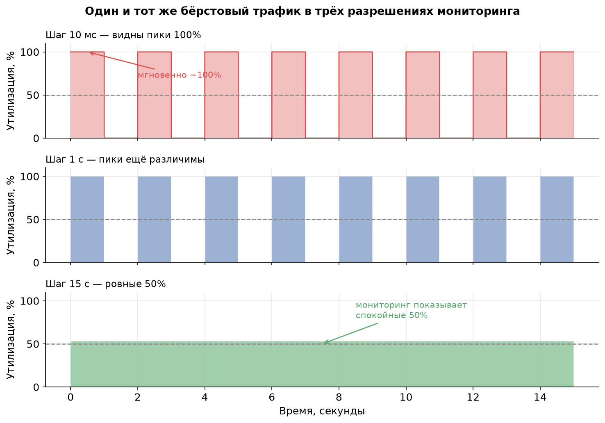
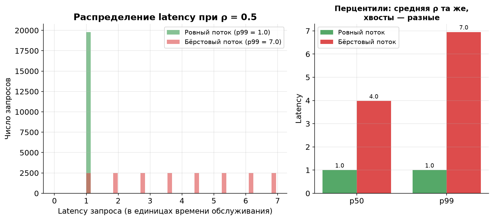
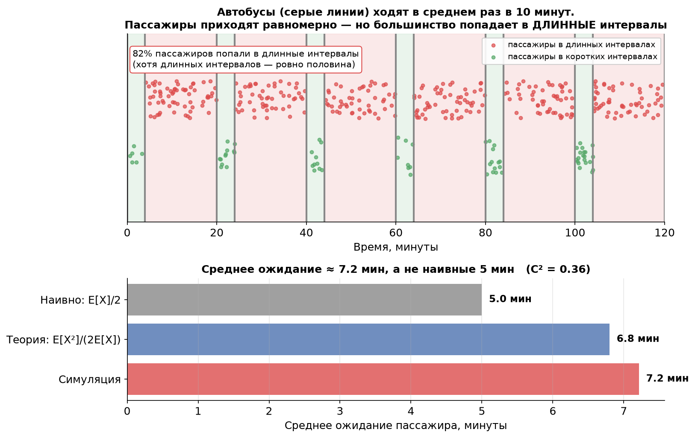

# Урок 6. Микробёрсты и «парадокс времени ожидания»

> **TL;DR:** Система может ловить таймауты при средней загрузке 50%, потому что внутри 15-секундного интервала мониторинга прячутся миллисекундные всплески, в которых мгновенная нагрузка близка к 100%. Усреднение прячет пики: чем крупнее шаг агрегации, тем «спокойнее» выглядит график. А парадокс инспекции (inspection paradox) объясняет, почему пришедший в случайный момент запрос почти всегда застаёт систему в самый неудачный момент — и откуда в формуле Поллачека — Хинчина берётся фактор $(1+C^2)/2$.

В уроке 5 мы вывели формулу Поллачека — Хинчина и увидели, что время ожидания взрывается не только из-за высокой утилизации $\rho$, но и из-за **вариативности** размеров задач (множитель $(1+C^2)/2$). Сейчас разберёмся, откуда этот множитель берётся «физически», и почему даже умеренная средняя загрузка не спасает от тормозов.

## Микробёрсты: 50% на графике, таймауты в реальности

Представьте кофейню, где за час обслужили 30 человек. Бариста работал ровно полчаса из шестидесяти минут — отчёт говорит: «загрузка 50%, всё спокойно». Но если все 30 человек пришли тремя автобусными группами по 10, то в момент прихода группы перед стойкой выстраивается очередь, в которой кто-то ждёт свой капучино 15 минут и уходит, не дождавшись. Средняя загрузка честная — 50%. Опыт клиента — ужасный.

В highload-системах это и есть **микробёрсты (microbursts)** — кратковременные всплески нагрузки длиной в миллисекунды или единицы секунд, в которые мгновенная интенсивность входящего потока подскакивает в разы выше средней. Запросы внутри всплеска конкурируют за один и тот же GPU или одного консьюмера, выстраиваются в очередь и ловят таймауты, хотя на дашборде утилизация выглядит безобидно.

### Числовой пример: всплеск + тишина = «ровные» 50%

Возьмём окно мониторинга 15 секунд. Пусть нагрузка устроена так:

- **1 секунда — всплеск:** запросы летят с интенсивностью в 10 раз выше средней, мгновенная утилизация мощности ≈ 100%;
- **1 секунда — тишина:** запросов нет, утилизация 0%.

Чередуем эти два состояния всё окно. Средняя утилизация:

$$\bar\rho = \frac{1 \cdot 100\% + 1 \cdot 0\%}{2} = 50\%.$$

Ровно столько же показал бы **спокойный ровный поток**, в котором запросы приходят равномерно и сервер загружен наполовину постоянно. Две совершенно разные реальности — одно и то же число на графике. В бёрстовом варианте половину времени система перегружена в две руки, а другую половину простаивает; в ровном — ей всегда комфортно.

## Усреднение скрывает правду

Ключевая ловушка мониторинга: **график утилизации — это уже усреднённая величина**. Метрика «утилизация за 15 секунд» по определению размазывает всё, что происходило внутри этих 15 секунд, в одно число. Чем крупнее шаг агрегации, тем сильнее сглаживаются пики.

На графике — **один и тот же трафик** в трёх разрешениях:

- **Шаг 10 мс:** видно реальность — мгновенная нагрузка скачет между 0% и 100%.
- **Шаг 1 с:** пики ещё различимы, но картинка уже грубее.
- **Шаг 15 с:** ровная зелёная полоса на 50%. Мониторинг рапортует, что всё прекрасно, — а пользователи в этот момент ловят таймауты.

Усреднение математически корректно и при этом обманчиво: среднее значение существует, но оно ничего не говорит про то, что чувствует **отдельный** запрос. А запрос живёт не в усреднённом мире — он приходит в конкретную миллисекунду и либо попадает в тишину, либо в самую гущу всплеска.

### Что с этим делать: смотреть на перцентили задержки

Практический вывод простой: **средняя утилизация — плохой индикатор здоровья системы**. Гораздо честнее смотреть на **перцентили задержки (latency percentiles)** — p99, p999. Они напрямую отвечают на вопрос «сколько ждал самый невезучий 1% запросов», и именно их портят микробёрсты, оставляя среднюю утилизацию нетронутой.

Симуляция ниже показывает разницу в лоб. Один сервер (FIFO), время обслуживания постоянное, утилизация $\rho = 0.5$ в обоих случаях. Отличается только распределение моментов прихода: ровный поток против бёрстового (запросы пачками).

При ровном потоке каждый запрос обслуживается мгновенно: p50 = p99 = 1 (в единицах времени обслуживания), очереди нет вообще. При бёрстовом — та же средняя загрузка 50%, но **p99 вырастает в 7 раз**: запросы из конца пачки ждут, пока сервер разгребёт всех, кто прибежал раньше. Средняя утилизация ничего об этом не сказала бы.

> **Мостик к итоговой работе курса.** Если усреднённые метрики слепы к микробёрстам, то как вообще измерить мгновенную нагрузку? Один из приёмов — активно «прощупывать» систему лёгкими пробными задачами с высокой частотой и смотреть на их задержку (механизм вроде **SelfPing**). Это и есть тема итоговой практической работы — пока просто запомните, что прямое измерение задержки бьёт усреднённую утилизацию.

## Парадокс инспекции: почему запросу всегда не везёт

Теперь — вторая половина урока, которая объясняет микробёрсты с другой стороны и заодно «закрывает долг» по формуле из урока 5.

Классическая формулировка про автобусы. Автобусы ходят **«в среднем раз в 10 минут»**. Вы приходите на остановку в случайный момент. Сколько в среднем придётся ждать? Наивный ответ: «раз в среднем интервал 10 минут, а я попадаю в случайную его точку, то жду в среднем половину — 5 минут». И это **неверно**, если интервалы вариативны.

Дело в **парадоксе инспекции (inspection paradox)**, он же waiting time paradox. Приходя в случайный момент времени, вы с большей вероятностью попадаете в **длинный** интервал, чем в короткий — просто потому, что длинные интервалы занимают больше места на оси времени. Вероятность попасть в интервал **пропорциональна его длине**. Короткие интервалы «проскакивают» мимо вас, длинные — «ловят».

На верхней панели интервалы между автобусами чередуются: 4 минуты (короткий) и 16 минут (длинный), среднее — ровно 10. Длинных интервалов **ровно половина по количеству**, но они занимают 80% временной оси. Пассажиры приходят равномерно — и **82% из них попадают в длинные интервалы**. Их-то и ждёт долгое ожидание, которое тянет среднее вверх.

### Формула среднего остаточного времени

Формализуется это **средним остаточным временем (mean residual time)** — сколько в среднем осталось ждать до конца интервала, в который вы случайно попали:

$$E[R] = \frac{E[X^2]}{2\,E[X]} = \frac{E[X]\,(1 + C^2)}{2},$$

где $X$ — длина интервала, а $C^2 = \dfrac{\operatorname{Var}(X)}{E[X]^2}$ — квадрат коэффициента вариации.

Смысл двух форм один и тот же:

- Первая форма $\dfrac{E[X^2]}{2E[X]}$ показывает, что ожидание определяется **вторым моментом** $E[X^2]$, а не только средним. А второй момент «штрафует» за длинные интервалы квадратично — поэтому редкие большие интервалы влияют на ответ непропорционально сильно.
- Вторая форма $\dfrac{E[X](1+C^2)}{2}$ раскладывает ответ на «наивную» половину среднего $\dfrac{E[X]}{2}$, домноженную на поправку $(1+C^2)$ за вариативность.

Проверим на автобусах. $E[X] = 10$, $E[X^2] = \frac{4^2 + 16^2}{2} = \frac{16 + 256}{2} = 136$, отсюда $C^2 = \frac{136 - 100}{100} = 0.36$:

$$E[R] = \frac{136}{2 \cdot 10} = 6.8 \text{ минуты}.$$

Не 5 минут, а 6.8 — на 36% больше наивной оценки. И это при умеренной вариативности. Симуляция на нижней панели графика подтверждает: фактическое среднее ожидание ≈ 7.2 минуты (небольшое расхождение с теорией — конечное число автобусов в окне).

Два важных частных случая:

- **Детерминированные интервалы** ($C^2 = 0$, автобусы строго по расписанию): $E[R] = \frac{E[X]}{2}$. Наивный ответ верен — но только здесь.
- **Экспоненциальные интервалы** ($C^2 = 1$, пуассоновский поток без памяти, как в уроке 4): $E[R] = E[X]$. Ждать придётся в среднем **целый интервал**, а не половину! Из-за отсутствия памяти неважно, как давно ушёл прошлый автобус.

### Откуда в формуле Поллачека — Хинчина берётся $(1+C^2)/2$

Вот обещанная связь с уроком 5. Вспомните формулу для среднего времени ожидания в M/G/1:

$$W_q = \frac{\rho}{1 - \rho} \cdot \frac{1 + C_s^2}{2} \cdot E[S].$$

Множитель $\dfrac{1 + C_s^2}{2}$ — это **ровно тот же парадокс инспекции**, только применённый к **времени обслуживания**, а не к интервалам между автобусами.

Логика такая. Запрос, пришедший в систему, с некоторой вероятностью застаёт сервер занятым. Но раз сервер занят — значит, он сейчас обслуживает **какую-то** задачу. Какую? По парадоксу инспекции — скорее **длинную**, чем короткую (длинные задачи дольше «висят» на сервере и потому чаще попадаются). Пришедшему запросу нужно дождаться **остаточного времени** дообслуживания этой задачи, а оно в среднем равно $\dfrac{E[S^2]}{2E[S]} = E[S] \cdot \dfrac{1 + C_s^2}{2}$ — той самой формуле остаточного времени, что и для автобусов.

Иными словами: фактор $(1+C_s^2)/2$ в Поллачеке — Хинчине — это **среднее «дообслуживание» той задачи, которую застал пришедший запрос**. Чем разнообразнее размеры задач, тем чаще новичок натыкается на «дожёвывание» особо жирной — и тем дольше его ожидание.

### Практический пример

- **ML-инференс на GPU.** Запросы на инференс разного размера (разные тензоры). Лёгкий запрос приходит и застаёт GPU посреди обработки **тяжёлого батча** — и вынужден ждать, пока тот дожуётся целиком. По парадоксу инспекции лёгкий запрос непропорционально часто застаёт именно тяжёлую задачу: она дольше занимает GPU. Среднее время инференса может быть скромным, а p99 — катастрофическим.
- **Kafka.** Консьюмер читает сообщения из топика по одному (FIFO). Если в потоке попадаются **гигантские сообщения** (например, большой батч событий в одном message), то очередное обычное сообщение придёт ровно в тот момент, когда консьюмер увяз в обработке гиганта. Consumer lag дёрнется вверх, хотя средний размер сообщения мал. Это микробёрст в чистом виде — и парадокс инспекции объясняет, почему «застать» обработку гиганта вероятнее, чем кажется.

## Главное из урока

- **Микробёрст** — кратковременный всплеск нагрузки, в который мгновенная утилизация близка к 100%, даже если средняя — всего 50%. Запросы внутри всплеска конкурируют за ресурс и ловят таймауты.
- **Усреднение скрывает пики:** чем крупнее шаг агрегации мониторинга (15 с против 10 мс), тем «спокойнее» выглядит график. Средняя утилизация ничего не говорит про опыт отдельного запроса.
- Здоровье системы честнее показывают **перцентили задержки** (p99, p999), а не средняя утилизация: при той же $\rho = 0.5$ бёрстовый трафик раздувает p99 в разы.
- **Парадокс инспекции:** приходя в случайный момент, вы с вероятностью, пропорциональной длине интервала, попадаете в **длинный** интервал. Поэтому среднее ожидание больше наивного $E[X]/2$.
- Среднее остаточное время: $E[R] = \dfrac{E[X^2]}{2E[X]} = \dfrac{E[X](1+C^2)}{2}$. Для $C^2=0$ это $E[X]/2$, для пуассоновского потока ($C^2=1$) — целый интервал $E[X]$.
- Фактор $(1+C_s^2)/2$ в формуле Поллачека — Хинчина — это и есть среднее **дообслуживание** той задачи, которую застал пришедший запрос: чаще застаёшь длинную, потому что она дольше занимает сервер.
- На практике это «тяжёлый батч на GPU» и «гигантское сообщение у консьюмера Kafka»: новый запрос систематически застаёт ресурс на самой невыгодной для себя задаче.

В уроке 7 посмотрим, как с этим бороться при масштабировании: правило квадратного корня для запаса мощности и разница между дисциплинами FIFO и Processor Sharing — последняя как раз умеет гасить эффект вариативности.

## Проверь себя

### Вопрос 1
График утилизации с шагом 15 секунд показывает ровные 50%, но пользователи жалуются на таймауты. Что наиболее вероятно происходит?

- [ ] Мониторинг сломан и показывает неверное число
- [x] Внутри 15-секундных окон есть микробёрсты, в которых мгновенная нагрузка близка к 100%
- [ ] Утилизация 50% — это всегда слишком высокая нагрузка
- [ ] Запросы теряются в сети ещё до попадания в систему

> **Пояснение:** Средняя утилизация 50% может складываться из чередования всплесков (≈100%) и тишины (0%). Усреднение по 15 секунд прячет эти пики. Мониторинг при этом не врёт — он честно показывает среднее, просто среднее не отражает опыт отдельного запроса. А 50% сами по себе — умеренная нагрузка, проблема именно в её неравномерности.

### Вопрос 2
Чем крупнее шаг агрегации метрики утилизации, тем...

- [ ] точнее видно мгновенные всплески нагрузки
- [x] сильнее сглаживаются пики и тем безобиднее выглядит график
- [ ] выше становится среднее значение утилизации
- [ ] меньше нагрузка на саму систему мониторинга, но картина точнее

> **Пояснение:** Усреднение по более широкому окну размазывает кратковременные пики в одно усреднённое число. Само среднее значение от размера окна не меняется (50% остаётся 50%), но информация о всплесках теряется. Поэтому для обнаружения микробёрстов нужны либо мелкий шаг, либо перцентили задержки.

### Вопрос 3
Автобусы ходят «в среднем раз в 10 минут», но интервалы вариативны. Вы приходите на остановку в случайный момент. Среднее время ожидания будет...

- [ ] ровно 5 минут — половина среднего интервала
- [ ] ровно 10 минут — целый средний интервал
- [x] больше 5 минут, потому что вы чаще попадаете в длинные интервалы
- [ ] меньше 5 минут, потому что короткие интервалы встречаются чаще

> **Пояснение:** Это парадокс инспекции. Вероятность попасть в интервал пропорциональна его длине, поэтому случайный наблюдатель систематически чаще оказывается в длинных интервалах. Ровно 5 минут получилось бы только при детерминированных интервалах ($C^2=0$). Ровно 10 минут — частный случай пуассоновского потока ($C^2=1$), а не общее правило.

### Вопрос 4
Чему равно среднее остаточное время $E[R]$ для **экспоненциально** распределённых интервалов со средним $E[X]$?

- [ ] $E[X]/2$
- [x] $E[X]$
- [ ] $E[X]/4$
- [ ] $2E[X]$

> **Пояснение:** Для экспоненциального распределения $C^2 = 1$, поэтому $E[R] = \frac{E[X](1+1)}{2} = E[X]$. Это прямое следствие отсутствия памяти: неважно, сколько вы уже прождали, ожидаемое оставшееся время всегда равно полному среднему интервалу. Ответ $E[X]/2$ — это наивная оценка, верная только при $C^2=0$.

### Вопрос 5
Что физически означает множитель $(1 + C_s^2)/2$ в формуле Поллачека — Хинчина для $W_q$?

- [ ] поправку на число серверов в системе
- [ ] вероятность того, что сервер занят
- [x] среднее остаточное время дообслуживания задачи, которую застал пришедший запрос
- [ ] долю запросов, попадающих в таймаут

> **Пояснение:** Пришедший запрос с большей вероятностью застаёт сервер за обработкой длинной задачи (парадокс инспекции применительно ко времени обслуживания). Множитель $(1+C_s^2)/2$ как раз и есть среднее остаточное время дообслуживания этой задачи, нормированное на $E[S]$. Чем больше разброс размеров задач ($C_s^2$), тем дольше типичное «дожёвывание».

### Вопрос 6
Лёгкий запрос на инференс приходит на GPU и регулярно застаёт его за обработкой тяжёлого батча. Почему «застать тяжёлый батч» вероятнее, чем кажется по доле тяжёлых запросов?

- [ ] потому что тяжёлые запросы приходят чаще лёгких
- [x] потому что тяжёлый батч дольше занимает GPU, и в любой случайный момент вероятнее застать именно его в работе
- [ ] потому что GPU специально приоритизирует тяжёлые задачи
- [ ] потому что лёгкие запросы обрабатываются мгновенно и не создают очереди

> **Пояснение:** Это парадокс инспекции. Даже если тяжёлых запросов мало по количеству, каждый из них занимает GPU надолго — а значит, в случайный момент времени вероятность застать GPU именно за тяжёлой задачей пропорциональна её длительности. Частота прихода тяжёлых запросов тут ни при чём; дело в том, какую долю **времени** ресурс занят длинными задачами.

## Задачи

### Задача 1
Консьюмер Kafka обрабатывает сообщения, время обработки которых принимает одно из двух значений: 2 мс (обычное сообщение) или 50 мс (гигантский батч). Обычные сообщения составляют 90% потока, гигантские — 10%. Новое сообщение приходит в случайный момент и застаёт консьюмер занятым. Сколько в среднем ему придётся ждать, пока консьюмер дожуёт текущее сообщение (среднее остаточное время $E[R]$)?

Решение

Время обработки $S$ принимает значения 2 мс (с вероятностью 0.9) и 50 мс (с вероятностью 0.1).

Первый момент:
$$E[S] = 0.9 \cdot 2 + 0.1 \cdot 50 = 1.8 + 5.0 = 6.8 \text{ мс}.$$

Второй момент:
$$E[S^2] = 0.9 \cdot 2^2 + 0.1 \cdot 50^2 = 0.9 \cdot 4 + 0.1 \cdot 2500 = 3.6 + 250 = 253.6 \text{ мс}^2.$$

Среднее остаточное время:
$$E[R] = \frac{E[S^2]}{2\,E[S]} = \frac{253.6}{2 \cdot 6.8} = \frac{253.6}{13.6} \approx 18.6 \text{ мс}.$$

**Ответ: ≈ 18.6 мс.** Обратите внимание: среднее время обработки сообщения — всего 6.8 мс, но ожидать дообслуживания приходится почти втрое дольше. Причина — те самые 10% гигантских батчей: они дают непропорционально большой вклад во второй момент $E[S^2]$ (квадрат «штрафует» за длинные задачи). Это и есть парадокс инспекции в действии — новое сообщение систематически застаёт консьюмер за обработкой гиганта.

Для сравнения, «наивная» оценка $E[S]/2 = 3.4$ мс — в пять с лишним раз меньше реальности.

### Задача 2
Интервалы между запусками тяжёлого фонового джоба распределены так: $X = 5$ минут с вероятностью 0.5 и $X = 25$ минут с вероятностью 0.5. (а) Найдите средний интервал $E[X]$ и квадрат коэффициента вариации $C^2$. (б) Случайный наблюдатель приходит в произвольный момент — найдите среднее остаточное время $E[R]$ по обеим формам формулы и убедитесь, что они совпадают. (в) Какова доля времени, которую наблюдатель проводит «внутри» длинных интервалов (25 минут)?

Решение

**(а)** Средний интервал:
$$E[X] = 0.5 \cdot 5 + 0.5 \cdot 25 = 15 \text{ минут}.$$

Дисперсия. Сначала второй момент:
$$E[X^2] = 0.5 \cdot 5^2 + 0.5 \cdot 25^2 = 0.5 \cdot 25 + 0.5 \cdot 625 = 12.5 + 312.5 = 325.$$
$$\operatorname{Var}(X) = E[X^2] - E[X]^2 = 325 - 225 = 100.$$
$$C^2 = \frac{\operatorname{Var}(X)}{E[X]^2} = \frac{100}{225} \approx 0.444.$$

**(б)** Через второй момент:
$$E[R] = \frac{E[X^2]}{2\,E[X]} = \frac{325}{2 \cdot 15} = \frac{325}{30} \approx 10.83 \text{ минуты}.$$

Через коэффициент вариации:
$$E[R] = \frac{E[X](1 + C^2)}{2} = \frac{15 \cdot (1 + 0.444)}{2} = \frac{15 \cdot 1.444}{2} = \frac{21.67}{2} \approx 10.83 \text{ минуты}.$$

Обе формы дают **≈ 10.83 минуты** — против наивной оценки $E[X]/2 = 7.5$ минут.

**(в)** Длинных и коротких интервалов поровну по количеству (по 50%), но доля **времени**, приходящаяся на длинные интервалы, пропорциональна их суммарной длине:
$$P(\text{наблюдатель в длинном интервале}) = \frac{0.5 \cdot 25}{0.5 \cdot 25 + 0.5 \cdot 5} = \frac{12.5}{15} \approx 0.83.$$

**Ответ:** наблюдатель проводит около **83%** времени внутри длинных интервалов, хотя по количеству их ровно половина. Именно это смещение и поднимает среднее ожидание выше наивного $E[X]/2$.

