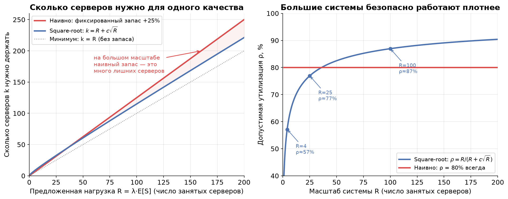
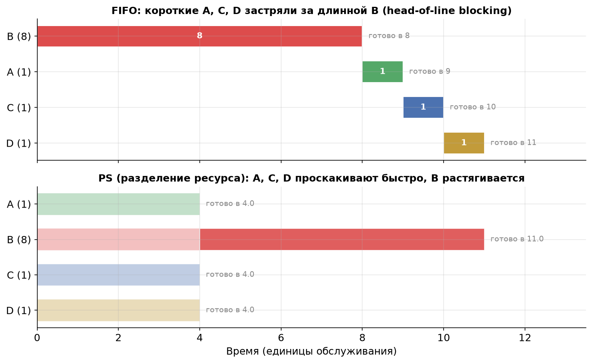
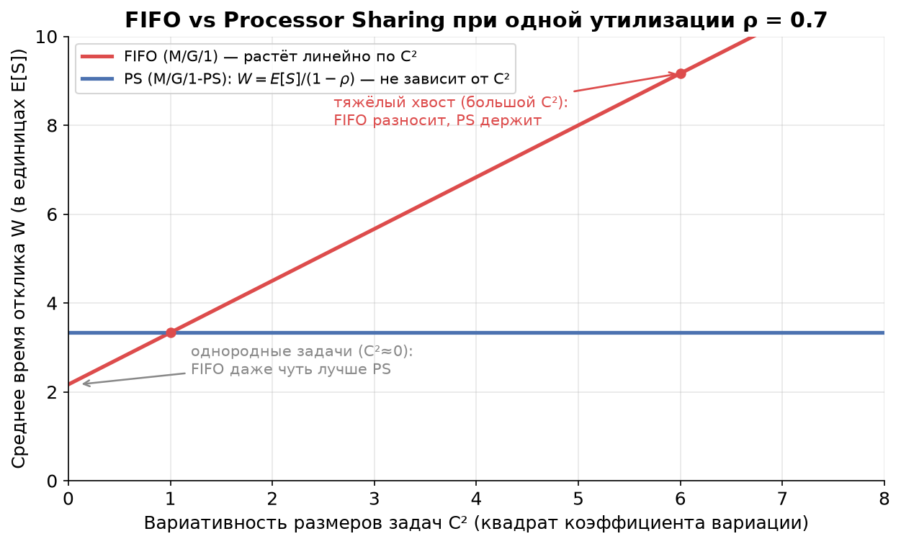

# Урок 7. Масштабирование и планировщики

> **TL;DR:** Чтобы держать прежнее качество при росте нагрузки, не нужно наращивать серверы пропорционально нагрузке — достаточно держать запас «свободной ёмкости» порядка квадратного корня из неё ($k \approx R + c\sqrt{R}$). Поэтому большие системы могут безопасно работать на более высокой утилизации, чем маленькие. А внутри одного сервера важно ещё и *как* раздаются ресурсы: FIFO (строго по очереди, как в Kafka-партиции) против Processor Sharing (всем понемногу, как CPU между потоками). В PS среднее время отклика зависит только от среднего размера задач и не чувствует их вариативность — спасение для тяжёлых хвостов.

В уроке 5 мы увидели по формуле Поллачека — Хинчина, что время ожидания взрывается при $\rho \to 1$ и сильно зависит от вариативности задач, а в уроке 6 — что бёрсты бьют даже при умеренной средней нагрузке. Естественный вопрос: как с этим жить, когда нагрузка растёт? В этом уроке — два рычага: **сколько** серверов добавлять (масштабирование) и **как** делить ресурс между задачами (планировщики).

## Правило квадратного корня: масштаб работает на вас

Начнём с интуиции из жизни. Представьте кофейню. Если в час пик приходит в среднем 4 клиента, а обслуживание одного занимает столько же, сколько приходит следующий, то «в работе» в среднем 4 клиента — это и есть **предложенная нагрузка (offered load)**:

$$R = \lambda \cdot E[S].$$

$R$ — это среднее число одновременно занятых серверов (в штуках, безразмерное). Чтобы не было очередей, серверов $k$ должно быть больше $R$ — нужен **запас свободной ёмкости** на случайные всплески.

Вопрос на миллион: на сколько больше? Наивная интуиция говорит «держи запас в процентах» — например, +25% серверов, то есть $k = 1{,}25 \cdot R$. Тогда утилизация всегда 80%, независимо от масштаба. Звучит разумно — но это переплата.

Правильный ответ даёт **правило квадратного корня (square-root staffing)**:

$$k \approx R + c\sqrt{R},$$

где $c$ — коэффициент, задающий желаемое качество (обычно $c$ от 1 до 2: чем больше, тем короче очереди и выше шанс, что свободный сервер найдётся сразу). Запас — это слагаемое $c\sqrt{R}$, и оно растёт не как $R$, а как $\sqrt{R}$.

### Почему именно корень

Глубокий вывод не нужен, нужна интуиция, и она простая — это закон больших чисел. Складываем $R$ независимых случайных «занятостей». Среднее суммы растёт линейно (как $R$), а вот **разброс** суммы — её стандартное отклонение — растёт только как $\sqrt{R}$. Случайные колебания нагрузки относительно среднего становятся всё мельче: при $R=4$ типичный всплеск — это $\pm 2$ от среднего (50%!), а при $R=400$ — это $\pm 20$ от среднего, то есть всего 5%. Большой системе достаточно куда меньшего относительного запаса, чтобы поглотить ту же по «качеству» случайность.

Именно поэтому запас имеет смысл держать пропорциональным $\sqrt{R}$, а не $R$: вы покрываете ровно тот масштаб флуктуаций, который реально возникает.

Левая панель: наивный фиксированный запас (красная) уходит всё дальше от честной потребности по мере роста нагрузки — на большом масштабе это десятки лишних серверов. Square-root-кривая (синяя) прижимается к диагонали $k=R$.

Правая панель — главное следствие. **Допустимая утилизация растёт с масштабом:**

$$\rho = \frac{R}{k} = \frac{R}{R + c\sqrt{R}} = \frac{1}{1 + c/\sqrt{R}}.$$

При $R=4$ и $c=1{,}5$ выходит $\rho \approx 57\%$ — маленькую систему приходится держать полупустой. При $R=100$ уже $\rho \approx 87\%$, при $R=400$ — около 93%. Это и есть **экономия от масштаба (economy of scale):** объединив десять маленьких пулов в один большой, вы при том же качестве работаете плотнее и тратите меньше железа.

### Что это значит на практике

- **Пул воркеров ML-инференса.** Десять отдельных пулов по 4 GPU каждый, работающих на безопасных 57%, — это расточительство. Один общий пул на 40 GPU при том же качестве спокойно живёт на ~85%. Поэтому общий шлюз инференса с маршрутизацией на свободный воркер почти всегда эффективнее, чем жёстко прибитые мелкие пулы.
- **Удвоение нагрузки не требует удвоения запаса.** Если трафик вырос с $R=100$ до $R=200$, наивно вы бы добавили серверов «+25% от удвоенного». На деле абсолютный запас должен вырасти лишь с $1{,}5\sqrt{100}=15$ до $1{,}5\sqrt{200}\approx 21$ — на шесть серверов, а не вдвое.
- **Осторожно с очень маленькими сервисами.** Сервис из 2–3 инстансов нельзя нагружать на 80% «потому что так у больших» — у него относительные флуктуации огромны, и очередь вырастет. Маленькое держим попросторнее.

## Планировщики: FIFO против Processor Sharing

Сколько серверов — это половина дела. Вторая половина: когда задачи всё-таки конкурируют за один ресурс, *в каком порядке* их обслуживать. Это **дисциплина планирования (scheduling discipline)**.

Вернёмся к кассе супермаркета. Есть два способа обслуживать очередь:

1. **FIFO (First-In-First-Out)** — строго по очереди. Кассир берёт первого клиента и доводит до конца, потом второго, и так далее. Кто пришёл раньше — уходит раньше.
2. **Processor Sharing (PS)** — «всем понемногу». Представьте, что кассир делит внимание между всеми клиентами в зале сразу: пробил один товар у первого, один у второго, один у третьего, по кругу. Если в зале $n$ клиентов, каждый получает $1/n$ скорости кассира.

В реальных кассах так не делают, а вот в компьютерах — постоянно. **Processor Sharing — это идеализация того, как ОС делит CPU между потоками** и как GPU делит время между процессами: round-robin с очень мелкими квантами времени. Каждый поток выполняется чуть-чуть, потом передаёт управление следующему — настолько быстро, что кажется, будто все работают одновременно. В пределе бесконечно мелких квантов это и есть PS.

А вот **Kafka-партиция — это чистый FIFO.** Консьюмер читает сообщения из партиции строго по порядку оффсетов; следующее сообщение не начнёт обрабатываться, пока не завершено (закоммичено) текущее. Это фундаментальное свойство, на нём держатся гарантии порядка.

### Кому какой планировщик выгоден

Ключевая разница — что происходит с короткой задачей, попавшей в систему вместе с длинной.

**В FIFO короткая задача может застрять за длинной.** Это **head-of-line blocking** («блокировка головой очереди»): даже если ваша задача — на одну миллисекунду, но перед ней встала задача на секунду, вы ждёте всю секунду. Никакой справедливости по размеру: порядок решает время прихода.

**В PS короткие задачи проскакивают быстро, но длинные растягиваются.** Поскольку ресурс делится, маленькая задача завершится почти сразу — ей нужно мало работы, а скорость она получает наравне со всеми. Зато длинная задача, пока вокруг толкутся короткие, тянет ресурс лишь частично и финиширует позже, чем финишировала бы, дай ей весь сервер целиком.

Посмотрим на одном примере. Пришли одновременно четыре задачи: одна длинная **B** (8 единиц работы) и три коротких — **A**, **C**, **D** (по 1 единице). В FIFO, как назло, первой в очереди оказалась B.

- **FIFO:** B доедает все 8 единиц, и только потом обслуживаются A, C, D. Короткие финишируют в моменты 9, 10, 11. Среднее время завершения по четырём задачам — **9,5**.
- **PS:** пока активны все четыре, каждая получает 1/4 скорости. Короткие A, C, D набирают свою единицу работы и финишируют в момент **4** — втрое быстрее, чем в FIFO! B остаётся одна и доделывается к моменту 11 (чуть позже, чем её 8 «в одиночку»). Среднее время завершения — **5,75**.

Короткие задачи в PS выиграли огромно, а длинная проиграла совсем немного. Если в вашем трафике много мелких задач и редкие гиганты (а это типичная картина с тяжёлыми хвостами из урока 4) — PS резко улучшает опыт большинства.

### Эффект insensitivity: PS не боится вариативности

Теперь — самое красивое свойство PS, ради которого о нём вообще стоит знать. Для системы **M/G/1-PS** (пуассоновский входящий поток, *произвольное* распределение размеров задач, один разделяемый сервер) среднее время отклика равно:

$$E[W] = \frac{E[S]}{1 - \rho}.$$

Вглядитесь в формулу. В ней есть только **среднее** время обслуживания $E[S]$ и утилизация $\rho$. И больше **ничего** — ни дисперсии, ни коэффициента вариации, ни формы хвоста. Это и есть **эффект нечувствительности (insensitivity):** среднее время отклика в PS зависит только от среднего размера задач и совершенно не зависит от их вариативности $C^2$.

(Условия, при которых это работает: пуассоновский поход заявок, дисциплина именно PS, рассматриваем стационарный режим $\rho < 1$. Вывод опускаем — он не добавляет интуиции сверх уже сказанного: PS не даёт длинным задачам монополизировать сервер, поэтому одна аномально большая задача не блокирует остальных и не раздувает среднее.)

Сравните это с FIFO. По формуле Поллачека — Хинчина из урока 5 среднее время ожидания в M/G/1-FIFO растёт прямо пропорционально $(1 + C^2)$:

$$W_q^{\text{FIFO}} = \frac{\rho \, E[S] \, (1 + C^2)}{2(1 - \rho)}.$$

Вариативность бьёт по FIFO напрямую: чем разнороднее задачи, тем дольше очередь.

На графике при фиксированной $\rho = 0{,}7$: FIFO (красная) растёт линейно по $C^2$, PS (синяя) — ровная горизонталь. Две вещи стоит заметить:

- **При $C^2 = 1$ (экспоненциальные размеры) линии пересекаются** — здесь FIFO и PS дают одинаковое среднее время отклика. Это не совпадение: M/M/1 и M/M/1-PS имеют одинаковое среднее $W$.
- **При $C^2 < 1$ (однородные задачи) FIFO даже чуть лучше** — потому что не наказывает короткие задачи лишним переключением. А вот правее, на тяжёлых хвостах, FIFO улетает вверх, тогда как PS держит планку.

### Практический вывод

Сведём всё к одному правилу выбора:

- **Задачи однородные** (низкий $C^2$, все примерно одного размера) — берите **FIFO**. Он не хуже по среднему, проще, дешевле и сохраняет порядок. Городить разделение ресурса незачем.
- **Вариативность высокая и её не убрать** (тяжёлый хвост, мешанина из мелких и гигантских задач) — **разделение ресурса (PS) спасает от хвостов**: среднее время отклика перестаёт чувствовать дисперсию, а короткие задачи не стоят за гигантами.

И возвращаясь к нашим героям:

- **Kafka-партиция = строгий FIFO.** Если в одну партицию валятся вперемешку лёгкие и тяжёлые сообщения, тяжёлое заблокирует голову очереди и раздует lag по всем лёгким (head-of-line blocking в чистом виде). Лечится не сменой планировщика — Kafka его не меняет, — а **разнесением:** тяжёлые и лёгкие сообщения в разные топики/партиции, чтобы у каждого класса была своя очередь и они не блокировали друг друга. Это «ручной» способ получить эффект, похожий на разделение ресурса.
- **GPU/CPU time-slicing ≈ PS.** Когда несколько процессов делят один GPU через time-slicing (или несколько потоков — одно ядро), вы фактически в режиме PS: мелкие инференс-запросы проскакивают, не дожидаясь, пока крупный батч досчитается. Для пула ML-инференса с разнородными размерами тензоров это удобно — но помните, что за нечувствительность к вариативности вы платите растягиванием самых крупных задач.

## Главное из урока

- **Предложенная нагрузка** $R = \lambda E[S]$ — это среднее число одновременно занятых серверов. Серверов нужно $k > R$ с запасом на флуктуации.
- **Правило квадратного корня:** запас держат пропорционально $\sqrt{R}$, а не $R$: $k \approx R + c\sqrt{R}$. Причина — флуктуации нагрузки растут как $\sqrt{R}$ (закон больших чисел), а не линейно.
- **Экономия от масштаба:** допустимая утилизация $\rho = R/(R+c\sqrt{R})$ растёт с масштабом. Большой общий пул работает плотнее и дешевле, чем россыпь маленьких. Удвоение нагрузки не требует удвоения запаса.
- **FIFO** (Kafka-партиция) обслуживает строго по очереди — короткая задача может застрять за длинной (**head-of-line blocking**). **Processor Sharing** (CPU/GPU time-slicing) делит ресурс между всеми сразу — короткие проскакивают, длинные растягиваются.
- **Insensitivity:** в M/G/1-PS среднее время отклика $E[W] = E[S]/(1-\rho)$ зависит только от среднего размера задач и не чувствует вариативность $C^2$. В FIFO вариативность бьёт по ожиданию напрямую (Поллачек — Хинчин).
- **Правило выбора:** однородные задачи → FIFO (проще и не хуже); высокая неустранимая вариативность → разделение ресурса (PS) спасает от тяжёлых хвостов. В Kafka «разделение» имитируют, разнося тяжёлые и лёгкие сообщения по разным топикам.

В следующем (итоговом) уроке мы соберём всё вместе на реальном кейсе: почему механизм SelfPing — отправка пустых задач каждые 10 мс — ловит проблемы с latency, невидимые на обычных графиках утилизации.

## Проверь себя

### Вопрос 1
Нагрузка сервиса выросла вдвое: с $R = 100$ до $R = 200$ занятых серверов. Качество (коэффициент $c = 1{,}5$) хотим сохранить. Как изменится **абсолютный запас** свободной ёмкости?

- [ ] Тоже вырастет вдвое — с 15 до 30 серверов
- [x] Вырастет примерно с 15 до 21 сервера (как $\sqrt{R}$)
- [ ] Останется прежним — 15 серверов
- [ ] Вырастет вчетверо — запас пропорционален $R^2$

> **Пояснение:** запас по правилу квадратного корня равен $c\sqrt{R}$. Было $1{,}5\sqrt{100}=15$, стало $1{,}5\sqrt{200}\approx 21{,}2$. Удвоение нагрузки увеличивает запас лишь в $\sqrt{2}\approx 1{,}41$ раза, а не вдвое — в этом и суть экономии от масштаба.

### Вопрос 2
Почему большие системы можно безопасно нагружать на более высокую утилизацию, чем маленькие?

- [ ] Большие серверы физически мощнее и реже отказывают
- [x] Относительные случайные колебания нагрузки убывают с масштабом (растут как $\sqrt{R}$, а среднее — как $R$)
- [ ] В больших системах меньше вариативность размеров задач
- [ ] Закон Литтла перестаёт действовать на больших масштабах

> **Пояснение:** разброс суммы независимых нагрузок растёт как $\sqrt{R}$, а среднее — как $R$, поэтому относительный разброс $\sqrt{R}/R = 1/\sqrt{R}$ падает. Большой системе нужен меньший *относительный* запас, и она может жить на $\rho = R/(R+c\sqrt{R})$, которая растёт к 1. Вариативность размеров задач ($C^2$) тут ни при чём — это другой эффект (см. PS vs FIFO).

### Вопрос 3
В Kafka-партицию пришли вперемешку сообщения: одно «тяжёлое» (обрабатывается 2 секунды) и сто «лёгких» (по 5 мс). Тяжёлое оказалось первым по оффсету. Что произойдёт?

- [ ] Консьюмер обработает лёгкие первыми, отложив тяжёлое
- [ ] Kafka автоматически переключится в режим Processor Sharing
- [x] Все сто лёгких будут ждать ~2 секунды, пока не завершится тяжёлое (head-of-line blocking)
- [ ] Лёгкие сообщения будут потеряны из-за переполнения

> **Пояснение:** партиция Kafka — строгий FIFO по оффсетам. Следующее сообщение не обрабатывается, пока не закоммичено текущее. Тяжёлое сообщение в голове очереди блокирует все лёгкие за ним — классический head-of-line blocking. Сменить дисциплину внутри партиции нельзя; лечат разнесением тяжёлых и лёгких сообщений по разным топикам.

### Вопрос 4
В системе M/G/1-PS размеры задач имеют очень тяжёлый хвост: $C^2 = 9$. Как это повлияет на **среднее время отклика** по сравнению со случаем $C^2 = 1$ при той же $\rho$?

- [x] Никак — в PS среднее время отклика не зависит от $C^2$ (insensitivity)
- [ ] Вырастет в 5 раз, пропорционально $(1+C^2)/2$
- [ ] Вырастет линейно по $C^2$, как в FIFO
- [ ] Уменьшится, потому что короткие задачи проскакивают быстрее

> **Пояснение:** для M/G/1-PS справедливо $E[W] = E[S]/(1-\rho)$ — формула содержит только среднее $E[S]$ и $\rho$, дисперсии в ней нет. Это эффект нечувствительности. Линейный рост по $(1+C^2)$ — это про FIFO (Поллачек — Хинчин), а не про PS.

### Вопрос 5
Все ваши задачи практически одинакового размера ($C^2 \approx 0$). Какую дисциплину выбрать?

- [x] FIFO — он не хуже по среднему времени отклика, проще и сохраняет порядок
- [ ] Обязательно PS — он всегда лучше FIFO
- [ ] PS, потому что он снижает вариативность задач
- [ ] Разницы нет ни при каких условиях

> **Пояснение:** преимущество PS — нечувствительность к вариативности — на однородных задачах не нужно: вариативности и так нет. При $C^2 \le 1$ FIFO даёт не большее (а при $C^2<1$ даже чуть меньшее) среднее время отклика и при этом проще, дешевле и не ломает порядок. PS ничего не «снижает» в самих задачах — он лишь иначе делит ресурс.

### Вопрос 6
Что из перечисленного — корректная интерпретация $R = \lambda E[S]$?

- [ ] Это утилизация системы в процентах
- [x] Это среднее число одновременно занятых серверов (предложенная нагрузка)
- [ ] Это число серверов, которое нужно закупить
- [ ] Это среднее время ожидания в очереди

> **Пояснение:** $R = \lambda E[S]$ — предложенная нагрузка (offered load), безразмерная величина, равная среднему числу занятых серверов (по сути, это закон Литтла для «обслуживающей» части системы). Закупать нужно больше — $k \approx R + c\sqrt{R}$. Утилизация — это уже $\rho = R/k$.

## Задачи

### Задача 1
Сервис ML-инференса обрабатывает $\lambda = 800$ запросов в секунду, среднее время обслуживания одного запроса на воркере $E[S] = 100$ мс. Для целевого качества выбран коэффициент $c = 2$.

1. Найдите предложенную нагрузку $R$ и число воркеров $k$ по правилу квадратного корня.
2. Сравните с «наивным» подходом: держать фиксированный запас +25% серверов. Сколько воркеров сэкономили?
3. На какой утилизации $\rho$ работает square-root-вариант?

Решение

**1. Предложенная нагрузка и square-root staffing.**

$$R = \lambda \cdot E[S] = 800 \cdot 0{,}1\,\text{с} = 80.$$

В среднем заняты 80 воркеров. По правилу квадратного корня:

$$k_{\text{sqrt}} = R + c\sqrt{R} = 80 + 2\sqrt{80} = 80 + 2 \cdot 8{,}94 \approx 80 + 17{,}9 = 97{,}9.$$

Округляем вверх: **$k_{\text{sqrt}} = 98$ воркеров.**

**2. Наивный подход и экономия.**

Фиксированный запас +25%:

$$k_{\text{naive}} = 1{,}25 \cdot R = 1{,}25 \cdot 80 = 100.$$

Разница невелика — **2 воркера** — потому что $R=80$ ещё не очень большой. Но обратите внимание, как разрыв растёт с масштабом: при $R = 800$ (трафик ×10) было бы $k_{\text{sqrt}} = 800 + 2\sqrt{800} \approx 857$ против $k_{\text{naive}} = 1000$ — экономия уже **143 воркера**, около 14% железа.

**3. Утилизация.**

$$\rho = \frac{R}{k_{\text{sqrt}}} = \frac{80}{98} \approx 0{,}816 = 81{,}6\%.$$

Сервис безопасно живёт на ~82% — заметно плотнее, чем мелкий сервис на пару воркеров мог бы себе позволить.

### Задача 2
Один воркер обслуживает поток заявок с утилизацией $\rho = 0{,}8$ и средним временем обслуживания $E[S] = 50$ мс. Размеры задач разнородные: $C^2 = 4$ (тяжёлый хвост).

1. Найдите среднее время отклика $E[W]$, если воркер использует **FIFO**.
2. Найдите $E[W]$, если воркер использует **Processor Sharing**.
3. Во сколько раз PS лучше? Что изменится, если хвост станет вдвое тяжелее ($C^2 = 8$)?

Решение

Полное время отклика $E[W] = E[S] + W_q$ (ожидание плюс само обслуживание).

**1. FIFO (формула Поллачека — Хинчина).**

$$W_q^{\text{FIFO}} = \frac{\rho\, E[S]\,(1 + C^2)}{2(1 - \rho)} = \frac{0{,}8 \cdot 50 \cdot (1 + 4)}{2 \cdot (1 - 0{,}8)} = \frac{0{,}8 \cdot 50 \cdot 5}{0{,}4} = \frac{200}{0{,}4} = 500\ \text{мс}.$$

$$E[W]^{\text{FIFO}} = 50 + 500 = 550\ \text{мс}.$$

**2. Processor Sharing (insensitivity).**

$$E[W]^{\text{PS}} = \frac{E[S]}{1 - \rho} = \frac{50}{1 - 0{,}8} = \frac{50}{0{,}2} = 250\ \text{мс}.$$

Дисперсия в формулу не входит — $C^2$ не используется вовсе.

**3. Сравнение и более тяжёлый хвост.**

$$\frac{E[W]^{\text{FIFO}}}{E[W]^{\text{PS}}} = \frac{550}{250} = 2{,}2 \ \text{раза в пользу PS}.$$

Если хвост утяжелить до $C^2 = 8$:

$$W_q^{\text{FIFO}} = \frac{0{,}8 \cdot 50 \cdot (1 + 8)}{0{,}4} = \frac{360}{0{,}4} = 900\ \text{мс}, \quad E[W]^{\text{FIFO}} = 950\ \text{мс}.$$

А PS не дрогнул: $E[W]^{\text{PS}} = 250$ мс по-прежнему. Теперь PS лучше уже в $950/250 = 3{,}8$ раза. **Вывод:** чем тяжелее хвост, тем сильнее разделение ресурса выигрывает у FIFO — ровно то, что обещает эффект нечувствительности.

