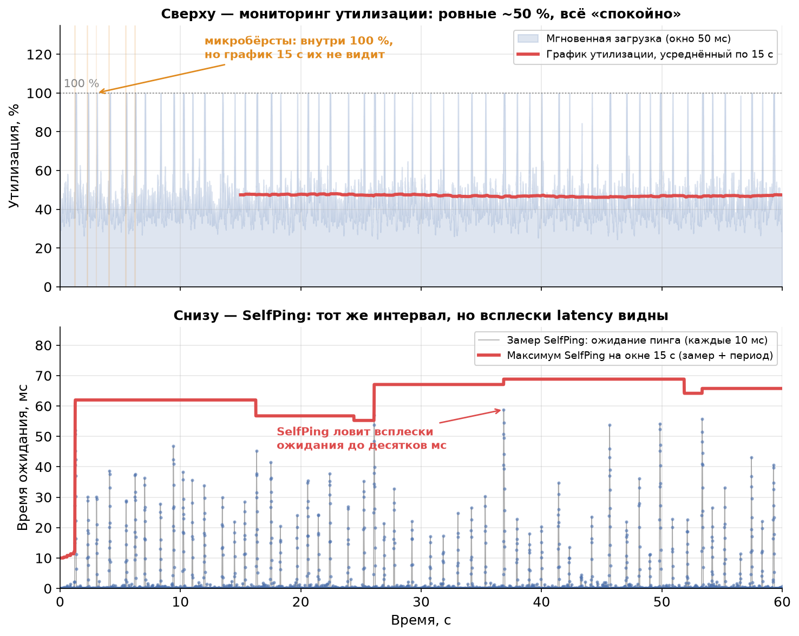
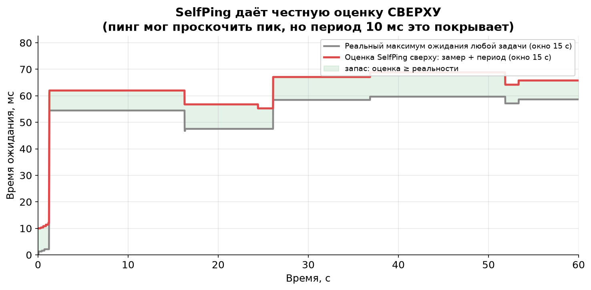

# Урок 8. Итоговая практическая работа: разгадка SelfPing

> **TL;DR:** Это финал курса. Мы разберём один красивый инженерный приём из продакшена Яндекса — **SelfPing**: строго периодически, каждые 10 мс, в тредпул кидается пустая задача, и измеряется, сколько она прождала в очереди. К замеру прибавляют период (10 мс) и берут максимум на окне 15 секунд. Этот простой трюк ловит микробёрсты, невидимые на графиках утилизации, — и чтобы понять, *почему* он работает, нужны почти все уроки курса сразу: теорема Литтла, время ожидания как индикатор очереди, нелинейность задержки от утилизации, тяжёлые хвосты и парадокс инспекции. Сначала вы сами письменно ответите на главный вопрос, потом сверитесь с разбором, а в конце пройдёте сквозной квиз по всему курсу.

Семь уроков назад мы начали с простого вопроса «из чего состоит latency» и постепенно собрали инструментарий: закон Литтла ($L = \lambda W$, урок 2), нотацию Кендалла (урок 3), свойство памяти и тяжёлые хвосты (урок 4), формулу Поллачека — Хинчина и эффект утилизации (урок 5), микробёрсты с парадоксом инспекции (урок 6), масштабирование и планировщики (урок 7). Пришло время проверить, что всё это сложилось в единую картину. Лучший способ — взять реальную инженерную задачу и разобрать её до основания.

## Откуда взялся этот курс

Весь наш курс вырос из одной статьи — [«Изучаем Latency: теория массового обслуживания»](https://habr.com/ru/companies/yandex/articles/431650/) Сергея Трифонова (Яндекс). Это блестящий разбор того, как теория очередей помогает понять задержки в боевых highload-системах. Если убрать леса́ из примеров и аналогий, которые мы строили семь уроков, под ними окажется ровно её скелет.

В финале статьи автор описывает приём из системы RTMR — **SelfPing**. Это не учебная игрушка, а работающий механизм мониторинга, который придумали инженеры, упёршиеся в ровно ту проблему, которую мы разбирали в уроке 6: дашборд показывает спокойные 50%, а пользователи ловят таймауты. Ваша итоговая работа — понять, почему этот механизм решает проблему.

## Часть 1. Постановка задачи

Сделайте это **до** того, как откроете разбор. Письменно — на бумаге или в заметках, неважно. Цель не «угадать ответ», а заставить себя сформулировать рассуждение целиком, опираясь на курс.

**Шаг 1. Прочитайте первоисточник.** Откройте статью: <https://habr.com/ru/companies/yandex/articles/431650/>

> **Что можно пропустить.** Разделы про **цепи Маркова** и **сети Джексона** (Jackson networks) выходят за рамки нашего курса — это отдельная большая тема про сети связанных очередей. Для итоговой работы они не нужны, читайте их по желанию. Всё остальное в статье вам уже знакомо по урокам — узнаете теорему Литтла, нотацию Кендалла, формулу Поллачека — Хинчина, парадокс инспекции.

**Шаг 2. Найдите в статье описание SelfPing** и ответьте письменно на главный вопрос:

> **Почему SelfPing — пустая задача каждые 10 мс — обнаруживает проблемы с latency, которые не видны на обычных графиках утилизации?**

**Шаг 3. Чтобы ответ был полным, проработайте наводящие подвопросы:**

1. Почему измеряют именно **время ожидания пинга в очереди**, а не загрузку CPU? Что время ожидания «знает» про систему такого, чего не знает утилизация?
2. Зачем к замеру прибавляют **период 10 мс** и почему это даёт оценку *сверху*, а не точное значение?
3. Почему на окне 15 секунд берут **максимум**, а не среднее замеров?
4. Какие свойства самих пинг-задач критически важны: почему они должны быть **маленькими** и почему **строго периодическими**? Что сломалось бы, если бы пинги были тяжёлыми или приходили в случайные моменты?
5. При чём здесь **парадокс инспекции** из урока 6 — и почему строгая периодичность пингов помогает его обойти?
6. Чего SelfPing **не увидит** в принципе? Где его слепая зона?

Не подсматривайте. Когда у вас на руках связный текст-ответ — открывайте разбор.

## Часть 2. Разбор

Разбор (откройте после того, как сформулируете свой ответ)

### Главный ответ в одном абзаце

График утилизации — это **усреднённая** величина (урок 6). «Утилизация 50% за 15 секунд» по определению размазывает всё, что было внутри окна, в одно число и слепнет к микробёрстам: внутри окна могут чередоваться миллисекундные периоды 100%-загрузки с растущей очередью и периоды простоя — в среднем всё равно выйдет 50%. SelfPing смотрит не на загрузку, а на **время ожидания в очереди**, причём с высокой частотой (каждые 10 мс) и беря **максимум**, а не среднее. Время ожидания — прямой индикатор того, что чувствует реальная задача, и оно реагирует на бёрст мгновенно, тогда как усреднённая утилизация его проглатывает. Ниже — по пунктам, как это связано с курсом.

### Почему время ожидания, а не загрузка CPU (уроки 2, 6)

Утилизация отвечает на вопрос «насколько занят сервер в среднем». Но нас волнует не сервер, а **запрос** — сколько он ждал. Это разные вещи, и связывает их теорема Литтла из урока 2: $L = \lambda W_q$. Длина очереди $L$ и время ожидания $W_q$ жёстко связаны — выросла очередь, выросло и время ожидания. Поэтому **измеряя время ожидания пинга, мы напрямую измеряем длину очереди** в этот момент. Пустая задача, попавшая в тредпул, прождёт ровно столько, сколько суммарно занимает работа, стоящая перед ней. Её время ожидания — это мгновенный «зонд» состояния очереди.

Утилизация так не умеет. Можно иметь утилизацию 50% и пустую очередь (ровный поток), а можно — те же 50% и периодически забитую очередь (бёрсты). Один и тот же показатель загрузки, две разные реальности для запроса (это ровно картинка из урока 6: 1 с всплеска + 1 с тишины = «ровные» 50%). Время ожидания эти две ситуации различает, а утилизация — нет.

Есть и вторая, более глубокая причина смотреть на ожидание. В уроке 5 формула Поллачека — Хинчина показала, что время ожидания **нелинейно** зависит от утилизации:

$$W_q \propto \frac{\rho}{1-\rho}.$$

Утилизация — плохой ранний индикатор именно из-за этой нелинейности: рост загрузки с 50% до 60% почти не двигает дашборд утилизации (+10 процентных пунктов выглядит безобидно), но множитель $\rho/(1-\rho)$ при этом растёт с 1,0 до 1,5 — время ожидания подскакивает в полтора раза. А переход с 90% на 95% удваивает его. Утилизация в районе пика прячет драму, которая разворачивается во времени ожидания. SelfPing смотрит сразу на «больного» — на ту величину, которая взрывается, — а не на «температуру», которая до последнего выглядит нормальной.

### Симуляция: слепой дашборд против зоркого SelfPing

Вот та же ситуация в лоб. Один обработчик (single server, FIFO), средняя загрузка ~47%, но работа приходит микробёрстами — короткими залпами по 25–55 мс, в которые очередь успевает подрасти, а между ними система всё разгребает.

Верхняя панель — мониторинг утилизации. Усреднённый по 15 секундам график (красная линия) держится в коридоре 46–48% и рапортует: всё спокойно. Полупрозрачная заливка снизу показывает мгновенную нагрузку — и видно, что внутри она регулярно пробивает 100%. Но усреднение по 15 с эти пики полностью съедает.

Нижняя панель — тот же самый интервал глазами SelfPing. Каждые 10 мс мы замеряем, сколько прождал бы пинг (синие точки), и берём максимум на окне 15 с (красная линия). И вот тут всплески ожидания **видны** — до нескольких десятков миллисекунд, тогда как на верхней панели не дрогнуло ничего. Один и тот же трафик, два датчика: один слеп, второй зорок.

### Зачем прибавлять период и брать максимум (уроки 4, 6)

**Почему максимум, а не среднее.** Это прямое следствие тяжёлых хвостов (урок 4) и того, что нас интересуют перцентили задержки, а не средняя (урок 6). Микробёрст — редкое, короткое и резкое событие. Если усреднить замеры SelfPing по окну, мы получим примерно ту же «слепую» среднюю, что и у утилизации, — редкий пик растворится в массе спокойных замеров. Максимум же по построению чувствителен ровно к худшему моменту: достаточно одного пинга, попавшего в бёрст, чтобы максимум на всём окне подскочил. Мы охотимся на хвост распределения, а максимум — это и есть инструмент для хвоста. SelfPing честно отвечает на вопрос «какой была самая плохая задержка за последние 15 секунд», а не «какая была средняя».

**Зачем прибавлять период 10 мс.** Пинги дискретны: между двумя соседними пингами 10 мс «слепоты». Пик очереди мог случиться и схлынуть между пингами, и тогда ни один замер его не поймает. Но — и это ключевая идея — за 10 мс очередь не может вырасти больше чем на 10 мс работы (сервер за это время либо разгребает старое, либо набирает новое, но не быстрее реального времени между пингами). Поэтому если предыдущий пинг показал ожидание $w$, то в любой момент до следующего пинга ожидание любой задачи не превышает $w + 10$ мс. Прибавив период к замеру, мы превращаем дискретные измерения в честную **оценку сверху** (upper bound) максимального времени ожидания на окне: «гарантирую, что хуже, чем столько-то, никому не было».

На графике серая линия — реальный максимум ожидания любой задачи на окне 15 с, красная — оценка SelfPing (замер + период). Красная всюду лежит не ниже серой: оценка добросовестно накрывает реальность с запасом (зелёная зона). SelfPing никогда не приукрашивает — в худшем случае слегка перестраховывается.

### Свойства пинг-задач: маленькие и строго периодические

**Почему маленькие.** Пинг должен *измерять* очередь, а не *создавать* её. Если бы пинг был тяжёлой задачей, он сам добавлял бы заметную работу в систему, увеличивал бы утилизацию и портил то, что измеряет (как термометр, который греет воду). Пустая задача почти не несёт работы, поэтому её собственное время обслуживания ≈ 0, и всё измеренное время — это чистое время ожидания в очереди, то есть честный портрет состояния системы. Отсюда и важнейшее свойство механизма из статьи: SelfPing потребляет **строго ограниченный объём CPU**. 6000 пустых задач в минуту при ~0 мс работы каждая — это пренебрежимая нагрузка, её можно гонять постоянно в продакшене.

**Почему строго периодически — и при чём тут парадокс инспекции.** Вспомните урок 6: если приходить на остановку в *случайные* моменты, вы с большей вероятностью попадаете в длинный интервал (парадокс инспекции, inspection paradox), и ваша выборка систематически смещена в сторону «плохих» периодов. Для SelfPing это был бы яд: случайные пинги давали бы смещённую оценку, завязанную на структуру самих бёрстов, и интерпретировать её было бы невозможно. **Строгая периодичность убивает смещение**: пинги стоят на оси времени равномерно, как разметка линейки, и каждый отрезок времени между ними одинаков — ровно 10 мс. Именно поэтому работает оценка «замер + период»: мы точно знаем шаг сетки и точно знаем, что между узлами очередь не успеет вырасти больше чем на этот шаг. Случайные пинги такой гарантии не дали бы — интервалы между ними были бы разными, и прибавлять было бы нечего конкретного.

То есть строгая периодичность здесь не для красоты, а несёт двойную нагрузку: убирает смещение инспекции при выборке и даёт жёсткую границу для оценки сверху.

### Чего SelfPing не увидит (слепая зона)

Честный инструмент знает свои границы:

- **Всплески короче периода пинга.** Пик очереди, который полностью уместился между двумя пингами (родился и схлопнулся внутри 10 мс), не будет замечен напрямую. Оценка «замер + период» гарантирует, что мы не *недооценим* худший случай на величину больше периода, но мгновенный острый пик внутри интервала сам по себе невидим. Хотите видеть мельче — уменьшайте период (ценой большего расхода CPU). Это явный, управляемый компромисс.
- **Где именно проблема.** SelfPing говорит «очередь в тредпуле распухала», но не говорит, *какие* запросы её распухали, какой код тормозил, какой клиент устроил бёрст. Это датчик симптома, а не диагноз. Он сигнализирует «копай здесь», дальше нужны трейсы и профайлеры.
- **Проблемы вне очереди тредпула.** Если задержка возникает до постановки в очередь (сеть, балансировщик — урок 1, propagation time) или внутри обслуживания одной долгой задачи, которая уже взята в работу, — SelfPing этого не покрывает. Он измеряет ровно одну вещь: ожидание в очереди конкретного тредпула.

### Почему этот приём так хорош

Соберём достоинства, перечисленные в статье, на языке курса:

- **Универсальный.** Измеряет фундаментальную величину — время ожидания в очереди, — которая по теореме Литтла связана с длиной очереди в любой системе массового обслуживания, независимо от природы задач.
- **Неинвазивный (non-invasive).** Не требует трогать код тредпула или самих задач: достаточно уметь класть в пул пустую задачу и засекать время. Никакой инструментации боевого кода.
- **С ограниченной ценой.** Строго фиксированный, пренебрежимо малый расход CPU — можно держать включённым всегда.
- **Даёт оценку сверху, а не среднее.** Отвечает на правильный вопрос — «насколько плохо было самому невезучему» — и делает это с гарантией не приукрасить.

Если ваш письменный ответ затронул хотя бы половину этих пунктов и связал их с уроками — поздравляю, курс сложился в голове в единую систему. Это и была цель.

## Главное из урока

- **SelfPing** — продакшен-приём: пустая задача каждые 10 мс измеряет своё время ожидания в очереди тредпула; берётся максимум на окне 15 с плюс период как оценка сверху.
- Он видит то, что слепо к усреднённой утилизации, потому что измеряет **время ожидания** (прямой индикатор длины очереди по Литтлу), а не среднюю загрузку.
- **Максимум, а не среднее** — потому что мы охотимся за хвостом распределения (микробёрстом), а среднее его растворяет.
- **Прибавленный период** превращает дискретные замеры в честную **оценку сверху**: за 10 мс очередь не вырастет больше чем на 10 мс работы.
- Пинги обязаны быть **маленькими** (чтобы измерять, а не создавать нагрузку) и **строго периодическими** (чтобы обойти парадокс инспекции и обосновать оценку сверху).
- SelfPing — датчик симптома: он не покажет всплески короче периода, причину проблемы и задержки вне очереди тредпула.

## Проверь себя

Финальный квиз — по **всему курсу**. Каждый вопрос проверяет один из ключевых концептов; «ловушки» внутри типичные.

### Вопрос 1
Запрос на ML-инференс идёт по сети 3000 км туда-обратно, плюс пересылка тензора по шине и сами вычисления на GPU. Инженер хочет сократить общую задержку. Какую её часть **нельзя** уменьшить, наращивая мощность сервера или распиливая запрос на части?

- [ ] Время передачи тензора по шине (transmission time)
- [ ] Время вычислений на GPU
- [x] Время распространения сигнала по сети (propagation time)
- [ ] Время постановки задачи в очередь тредпула

> **Пояснение:** Время распространения ограничено скоростью света — это константа географии, с которой остаётся только смириться (урок 1). Время передачи и вычислений сокращается мощностью или дроблением запроса, время в очереди — снижением нагрузки. А вот 3000 км по оптике сервер быстрее не пролетят, сколько GPU ни добавь.

### Вопрос 2
В топик Kafka поступает 2000 сообщений в секунду, консьюмер обрабатывает одно сообщение за 50 мс. Сколько сообщений в среднем «висит» в системе (обрабатывается или ждёт)?

- [ ] 40
- [x] 100
- [ ] 2000
- [ ] Зависит от распределения времени обработки, по данным не определить

> **Пояснение:** Теорема Литтла $L = \lambda W$: $L = 2000 \cdot 0{,}05 = 100$ сообщений (урок 2). Это **operational law** — он не зависит от вида распределения, поэтому вариант «зависит от распределения» — ловушка. Главное — не путать штуки с байтами: Литтл считает запросы в штуках.

### Вопрос 3
Сервис ML-инференса: запросы приходят случайно (по экспоненте), размеры тензоров разные, поэтому время обработки имеет произвольное распределение, обработчик один. Как записать эту систему в нотации Кендалла?

- [ ] D/M/1
- [ ] M/M/k
- [x] M/G/1
- [ ] G/G/1

> **Пояснение:** Случайный (марковский) входящий поток — **M**; произвольное распределение времени обслуживания — **G**; один сервер — **1** (урок 3). Получается **M/G/1** — именно та система, для которой работает формула Поллачека — Хинчина. **D** означало бы строго детерминированный поток, а он здесь случайный.

### Вопрос 4
Задача на GPU выполняется уже 100 мс. У распределения времени обслуживания **тяжёлый хвост** (Парето). Что разумнее всего ожидать про оставшееся время её выполнения?

- [ ] Она вот-вот закончится — чем дольше идёт, тем ближе к концу
- [x] Чем дольше она уже идёт, тем дольше, скорее всего, будет идти дальше
- [ ] Оставшееся время не зависит от того, сколько она уже выполнялась
- [ ] Оставшееся время всегда равно среднему времени обслуживания

> **Пояснение:** У тяжёлых хвостов убывающий failure rate: чем дольше задача длится, тем больше ожидаемое оставшееся время (урок 4). Вариант «не зависит» — это свойство памяти **экспоненциального** распределения (memoryless), а не Парето; здесь это ловушка. Практический вывод: долгие задачи стоит подозревать в том, что они затянутся ещё дольше.

### Вопрос 5
Система работает на утилизации $\rho = 0{,}8$. Нагрузка выросла, и утилизация поднялась до $\rho = 0{,}9$. Во сколько примерно раз изменился множитель $\rho/(1-\rho)$ в оценке времени ожидания?

- [ ] Примерно в 1,1 раза — рост на 10%
- [x] Примерно в 2,25 раза
- [ ] Не изменился — это линейная зависимость
- [ ] Уменьшился, потому что система стала эффективнее

> **Пояснение:** При $\rho=0{,}8$ множитель $0{,}8/0{,}2 = 4$; при $\rho=0{,}9$ — $0{,}9/0{,}1 = 9$. Отношение $9/4 = 2{,}25$ (урок 5, формула Поллачека — Хинчина). Задержка растёт **нелинейно** и улетает в бесконечность при $\rho \to 1$ — поэтому «всего +10 процентных пунктов утилизации» обернулись более чем двукратным ростом ожидания.

### Вопрос 6
Дашборд показывает ровные 50% утилизации за 15-секундные интервалы, но пользователи ловят таймауты. Какое объяснение наиболее вероятно?

- [ ] Дашборд сломан — при 50% таймаутов быть не может
- [x] Внутри 15-секундного окна прячутся микробёрсты: миллисекундные пики 100%-загрузки, размазанные усреднением
- [ ] Утилизация 50% — это слишком высоко, нужно держать ниже 10%
- [ ] Таймауты вызваны исключительно медленной сетью, очередь ни при чём

> **Пояснение:** Усреднение по крупному окну прячет микробёрсты: всплеск 100% + тишина дают честные 50% в среднем, но запросы внутри всплеска стоят в очереди и ловят таймауты (урок 6). Именно эту слепую зону и закрывает SelfPing. 50% сами по себе — нормальная загрузка, проблема не в уровне, а в неравномерности.

### Вопрос 7
Почему механизм SelfPing берёт **максимум** замеров на окне, а не среднее, и почему пинги отправляются **строго периодически**?

- [ ] Максимум считать быстрее среднего, а периодичность — чтобы не нагружать планировщик
- [x] Максимум чувствителен к редкому всплеску (хвосту), а строгая периодичность убирает смещение парадокса инспекции и обосновывает оценку сверху
- [ ] И то и другое — чтобы снизить расход CPU на пинги
- [ ] Среднее и максимум здесь эквивалентны, периодичность тоже не принципиальна

> **Пояснение:** Среднее растворило бы редкий микробёрст так же, как усреднённая утилизация (уроки 4, 6); максимум ловит худший момент. Случайные пинги попадали бы в длинные «плохие» интервалы чаще (парадокс инспекции, урок 6) и давали смещённую оценку, а равномерная сетка с шагом 10 мс даёт честную границу «замер + период».

### Вопрос 8
Один сервер, тяжёлые хвосты в размерах задач. Сравниваем дисциплины **FIFO** и **Processor Sharing (PS)**. Что верно?

- [ ] В FIFO короткая задача никогда не ждёт длинную
- [ ] В PS среднее время отклика сильно зависит от вариативности размеров задач
- [x] В PS среднее время отклика зависит только от среднего размера задач и не чувствует их вариативность (insensitivity)
- [ ] FIFO и PS дают одинаковое распределение задержек при любой нагрузке

> **Пояснение:** В PS ресурс делится между всеми задачами, поэтому короткая не застревает за длинной (нет head-of-line blocking), и среднее время отклика нечувствительно к вариативности — свойство insensitivity (урок 7). В FIFO же одна тяжёлая задача из хвоста блокирует всю очередь за собой — поэтому вариант «короткая никогда не ждёт длинную» как раз про PS, а не про FIFO.

## Задачи

### Задача 1
Тредпул обрабатывает запросы FIFO. SelfPing настроен с периодом 10 мс и окном 15 секунд. За последнее окно самый «невезучий» пинг показал время ожидания в очереди **42 мс**.

(а) Какую оценку сверху на максимальное время ожидания **любой** задачи за это окно даст SelfPing?
(б) Сколько всего пингов попадает в одно 15-секундное окно?
(в) Объясните, почему оценка из пункта (а) — именно *сверху*, а не точное значение.

Решение

**(а)** Оценка сверху = замер + период = $42 + 10 = 52$ мс.

**(б)** Пинги идут каждые 10 мс, окно 15 с = 15000 мс: $15000 / 10 = 1500$ пингов на окно.

**(в)** Пинги дискретны — между соседними замерами есть 10 мс «слепоты», и реальный пик очереди мог случиться между пингами, чуть выше последнего замера. Но за 10 мс очередь не может вырасти больше чем на 10 мс работы, поэтому истинный максимум ожидания гарантированно не превосходит «последний замер + период» = 52 мс. Мы не знаем точное значение пика (он где-то между 42 и 52 мс), но знаем, что выше 52 мс он точно не поднимался. Это и есть честная **оценка сверху**: SelfPing может слегка перестраховаться, но никогда не приукрасит реальность.

### Задача 2
Сервис ML-инференса. По мониторингу утилизация GPU за 15-секундные окна стабильно держится около **50%**, и команда считает, что запас по мощности огромный. Но p99 задержки регулярно пробивает SLA. Включили SelfPing — и максимум ожидания на окнах скачет от 1 мс в «тихие» окна до 60 мс в «плохие».

(а) Почему утилизация 50% и всплески ожидания 60 мс не противоречат друг другу?
(б) Какой концепт курса объясняет, почему именно p99, а не средняя задержка, страдает от этого?
(в) Что SelfPing подсказывает делать дальше и чего он принципиально не скажет?

Решение

**(а)** Утилизация 50% за 15 с — усреднённая величина. Внутри окна нагрузка может приходить **микробёрстами**: короткие залпы со 100%-мгновенной загрузкой, в которые очередь распухает (отсюда 60 мс ожидания), чередуются с простоем — в среднем выходит 50% (урок 6). Запас по средней мощности есть, но он не помогает в моменты всплесков: запрос живёт не в усреднённом мире, а в конкретную миллисекунду.

**(б)** Микробёрсты бьют по **хвосту** распределения задержки. Большинство запросов попадают в тихие промежутки и обслуживаются быстро — средняя задержка остаётся низкой. Но невезучий 1%, попавший в бёрст, ждёт долго — и это ровно p99/p999 (уроки 4, 6). Поэтому средняя задержка обманчиво спокойна, а перцентили хвоста портятся. Это та же причина, по которой SelfPing берёт максимум, а не среднее.

**(в)** SelfPing говорит «в эти окна очередь тредпула реально распухала — проблема не выдумана и она в очереди обработки». Дальше нужно копать: трейсы, профайлеры, анализ источника бёрстов (какой клиент/эндпоинт льёт залпами), возможно — сглаживание входящего потока или запас ёмкости по правилу квадратного корня (урок 7). Чего SelfPing **не скажет**: какой именно код тормозит, какой запрос виноват, и не покроет всплески короче своего периода 10 мс и задержки вне очереди этого тредпула (сеть, propagation time из урока 1).

## Заключение курса: что дальше

Вы прошли путь от «из чего состоит latency» до разбора боевого инженерного приёма, в котором сошлись почти все уроки сразу. Главный навык, который стоит унести: **задержка — это не свойство сервера, а свойство очереди**, и думать про неё нужно через время ожидания, перцентили и хвосты, а не через среднюю загрузку. Если этот сдвиг оптики произошёл — курс своё дело сделал.

Куда двигаться, если захотелось глубже:

- **Mor Harchol-Balter, «Performance Modeling and Design of Computer Systems: Queueing Theory in Action».** Лучший современный учебник по теории очередей именно для компьютерных систем — строго, но с упором на интуицию и практику. Прямое продолжение всего, что мы разбирали.
- **Блог Marc Brooker** (инженер AWS) — короткие, въедливые заметки про очереди, ретраи, тайм-ауты и масштабирование в реальных распределённых системах. Отличный мост от теории к продакшену.
- **«The Tail at Scale»** (Dean & Barroso, Google) — короткая статья-классика о том, почему в больших системах правит хвост распределения, а не среднее, и какими приёмами с ним борются. Идеально ложится на уроки 4 и 6.

Спасибо, что дошли до конца. Удачи в укрощении хвостов.
